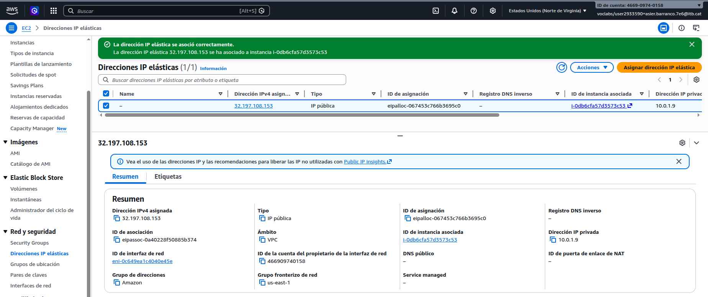
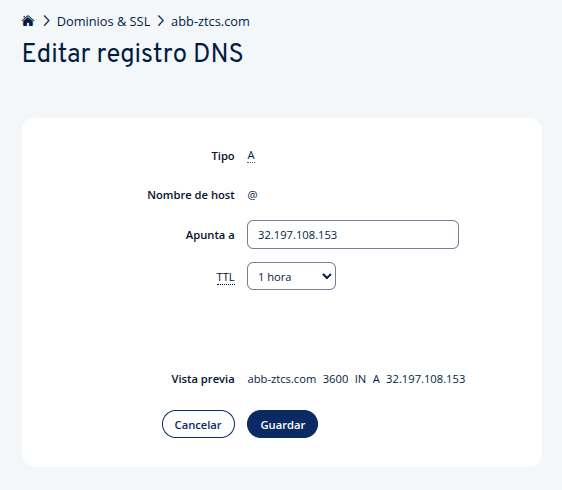
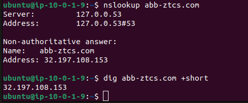
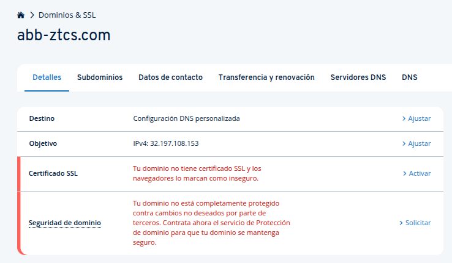

# Domain Registration, Elastic IP & DNS Configuration

**Project:** Zero Trust Corporate System  
**Author:** Asier Barranco  
**Date:** 07/05/2026  
**Version:** 1.0

---

## 1. Architecture Role

Before the Nginx reverse proxy can serve HTTPS traffic, two prerequisites must be in place: a stable public IP address for the perimeter instance and a domain name that resolves to it. This document covers both.

By default, EC2 instances receive a dynamic public IP that changes on every stop/start cycle — this makes it impossible to issue a TLS certificate or configure a reliable DNS record. An Elastic IP provides a persistent static address that survives instance reboots and is free of charge while associated with a running instance.

```
Internet → abb-ztcs.com → DNS A record (IONOS) → 32.197.108.153 (Elastic IP) → ztcs-perimeter (10.0.1.9)
```

**Key details:**

| Parameter | Value |
|---|---|
| Domain | `abb-ztcs.com` |
| Registrar / DNS provider | IONOS |
| Elastic IP | `32.197.108.153` |
| EC2 instance | `ztcs-perimeter` |
| Private IP | `10.0.1.9` |
| AWS region | `us-east-1` (N. Virginia) |

---

## 2. Domain Registration (IONOS)

The domain `abb-ztcs.com` was registered through [ionos.es](https://www.ionos.es).

**Registration details:**

| Field | Value |
|---|---|
| Registrar | IONOS SE |
| TLD | `.com` |
| Registration period | 1 year (annual billing) |
| Automatic renewal | Disabled |
| SSL add-on | Not contracted — TLS is managed by Let's Encrypt on the server |
| Hosting add-on | Not contracted — the EC2 instance is the web server |

> The IONOS-provided SSL certificate offer was declined. Certificate management is handled directly on `ztcs-perimeter` using Certbot against Let's Encrypt via the ACME HTTP-01 challenge. See `infrastructure/reverse-proxy/setup.md`.

---

## 3. Elastic IP Allocation and Association (AWS EC2)

### 3.1 Allocate the Elastic IP

1. Navigate to **AWS Console → EC2 → Network & Security → Elastic IPs** (region: `us-east-1`)
2. Click **Allocate Elastic IP address**
3. Leave the default pool (Amazon's IPv4 pool) — click **Allocate**

AWS allocated: **`32.197.108.153`**

### 3.2 Associate the Elastic IP

1. Select the newly allocated Elastic IP
2. **Actions → Associate Elastic IP address**
3. Resource type: **Instance**
4. Select instance: `ztcs-perimeter` (private IP `10.0.1.9`)
5. Click **Associate**



### 3.3 Verify SSH Access via Elastic IP

```bash
ssh -i /media/asier.barranco.7e6/ASIER/ZTCS/labsuser.pem ubuntu@32.197.108.153
```

The connection should succeed. From this point forward, `32.197.108.153` is the permanent public address of `ztcs-perimeter` — the SSH command no longer needs to be updated after each lab session restart.

> **Cost note:** an Elastic IP associated with a running instance incurs no charge. Charges apply (~$0.005/hour) only when the IP is allocated but not associated, or when the instance is stopped. If the instance is terminated at the end of the project, the Elastic IP must be released to avoid ongoing costs.

---

## 4. DNS A Record Configuration (IONOS)

### 4.1 Configure the A Record

1. Navigate to **IONOS Panel → Domains & SSL → `abb-ztcs.com` → DNS tab**
2. Locate the default A record (type `A`, host `@`, pointing to the IONOS parking IP)
3. Edit the record with the following values:

| Field | Value |
|---|---|
| Type | `A` |
| Hostname | `@` (zone apex — the root domain) |
| Points to | `32.197.108.153` |
| TTL | `3600` (1 hour) |

4. Click **Save**



> After saving, IONOS automatically deactivates its default site service records (AAAA `@`, TXT `_dep_ws_mutex`). This is expected — the domain is now serving the EC2 instance rather than the IONOS parking page.

### 4.2 Verify DNS Propagation

DNS propagation can take up to 24 hours, but typically resolves within 5-10 minutes for IONOS. Verify from within `ztcs-perimeter`:

```bash
nslookup abb-ztcs.com
dig abb-ztcs.com +short
```

Expected output:

```
ubuntu@ip-10-0-1-9:~$ nslookup abb-ztcs.com
Server:         127.0.0.53
Address:        127.0.0.53#53

Non-authoritative answer:
Name:   abb-ztcs.com
Address: 32.197.108.153

ubuntu@ip-10-0-1-9:~$ dig abb-ztcs.com +short
32.197.108.153
```

Both commands return `32.197.108.153` — DNS is resolving correctly.



---

## 5. Active DNS Zone

The following records are active in the IONOS DNS zone for `abb-ztcs.com`:

| Type | Host | Value | Purpose |
|---|---|---|---|
| A | `@` | `32.197.108.153` | This project — points to `ztcs-perimeter` |
| MX | `@` | `mx00.ionos.es` | Mail (IONOS default — not used) |
| MX | `@` | `mx01.ionos.es` | Mail (IONOS default — not used) |
| TXT | `@` | `v=spf1 include:...` | Mail SPF (IONOS default — not used) |
| CNAME | `_dmarc` | `dmarc.ionos.es` | Mail DMARC (IONOS default — not used) |
| CNAME | `_domainconnect` | `_domainconnect.ionos.com` | IONOS Domain Connect |

> Mail records are IONOS defaults created at registration time. They are not actively used in this project — email is out of scope. They do not interfere with the web infrastructure.



---

## 6. WireGuard Endpoint Update

Now that `ztcs-perimeter` has a permanent public IP, the WireGuard tunnel configuration on `DC01` no longer needs to be updated at each session start. Update the tunnel configuration on the Windows Server with the permanent endpoint:

1. Open the WireGuard application on `DC01`
2. Click **Edit** on the `ZeroTrust-VPN` tunnel
3. Update the `Endpoint` line:

```ini
Endpoint = 32.197.108.153:51820
```

4. Click **Save** → **Activate**

This change is permanent — the endpoint will not need to be updated again unless the Elastic IP is changed or released.

---

## 7. Summary

| Component | Details |
|---|---|
| Domain | `abb-ztcs.com` — registered at IONOS — 1 year |
| Elastic IP | `32.197.108.153` — allocated in us-east-1 — associated to `ztcs-perimeter` |
| DNS A record | `abb-ztcs.com` → `32.197.108.153` — TTL 3600 — propagated and verified |
| SSH access | Permanent — no longer changes between lab sessions |
| WireGuard endpoint | Updated to `32.197.108.153:51820` — permanent |