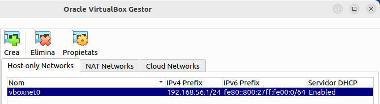
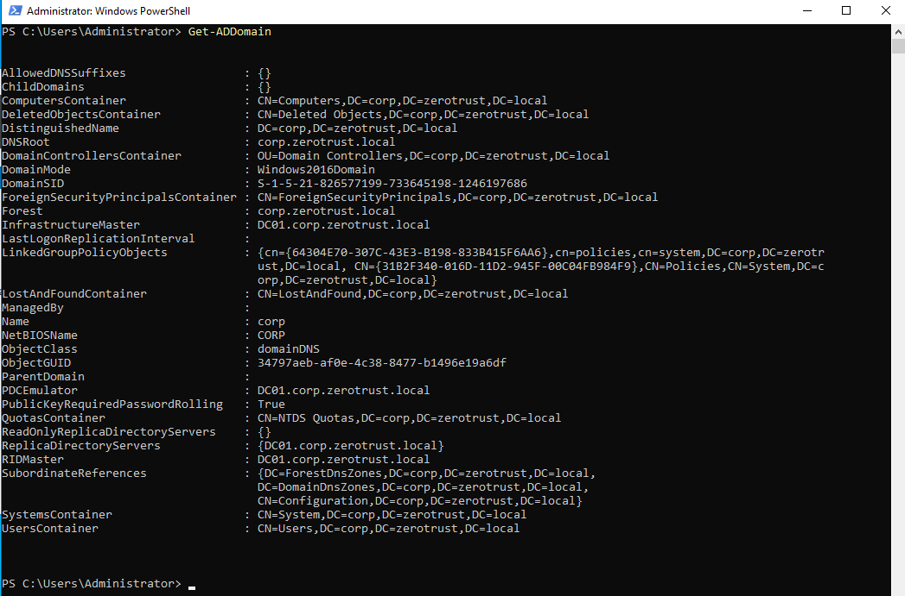
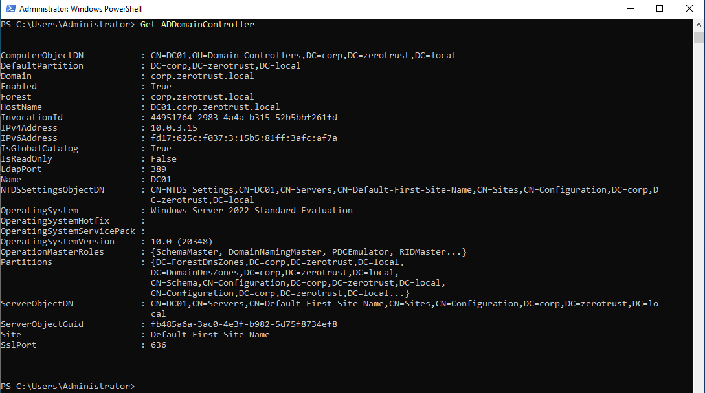
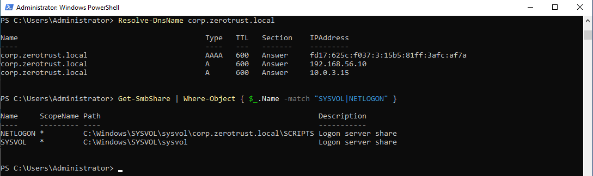
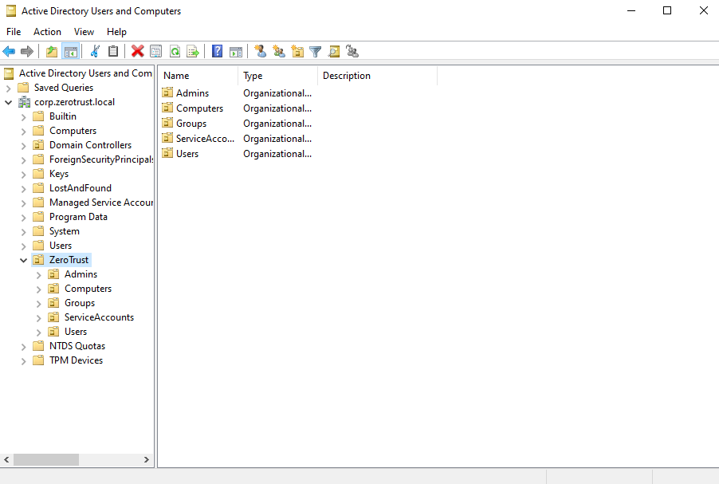
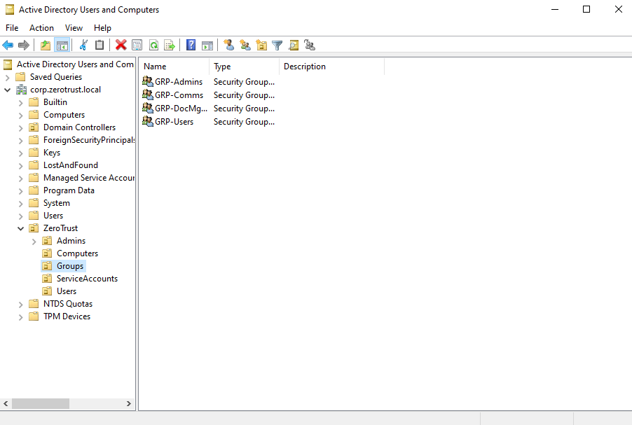
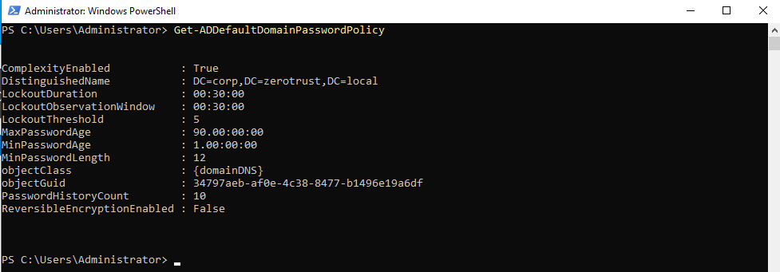
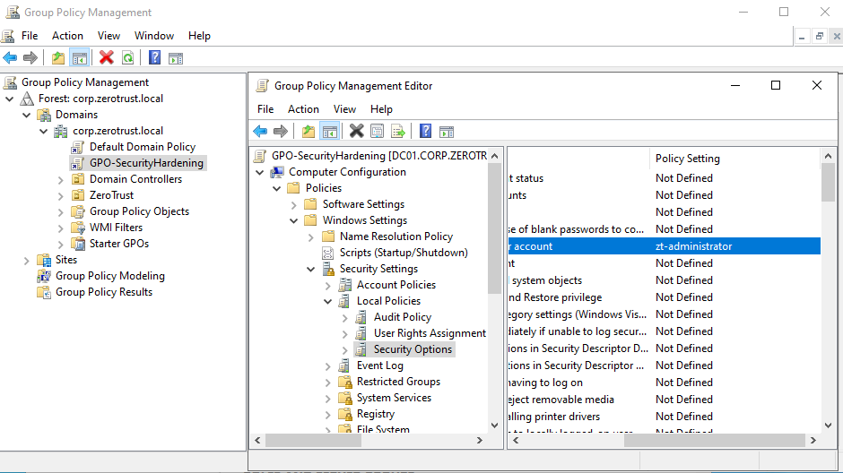
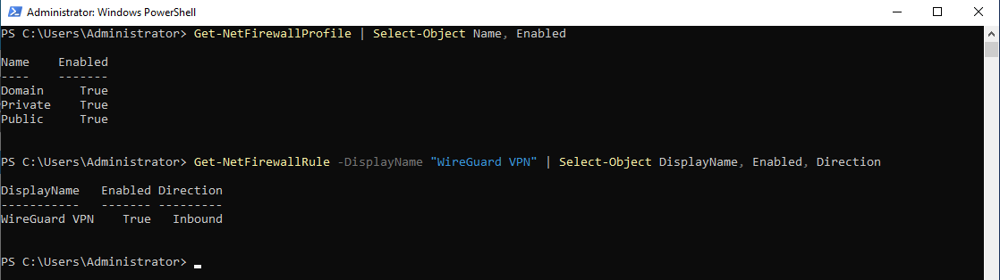

# Windows Server 2022 — Active Directory Setup

**Project:** Zero Trust Corporate System  
**Author:** Asier Barranco  
**Date:** 04/05/2026  
**Domain:** `corp.zerotrust.local`  
**NetBIOS:** `CORP`  
**Environment:** On-premise · Oracle VirtualBox  
**OS:** Windows Server 2022 Standard Evaluation (Desktop Experience)  
**Version:** 1.1  

---

## 1. Architecture Role

This server is the trust anchor of the entire Zero Trust architecture. It runs Active Directory Domain Services (AD DS) and acts as the single source of truth for all corporate identities, groups, access policies and authentication decisions.

No user can access any corporate service without first being authenticated against this domain controller. Keycloak (the identity provider deployed on AWS) federates with this server via LDAP through an encrypted WireGuard VPN tunnel.

**Key details:**

| Parameter | Value |
|---|---|
| Hostname | `DC01` |
| Domain | `corp.zerotrust.local` |
| Static IP (host-only) | `192.168.56.10` |
| Role | Primary Domain Controller + DNS Server |
| Admin account | `zt-administrator` (renamed from built-in Administrator) |
| VPN endpoint (future) | WireGuard on port 51820/UDP |
| LDAP endpoint (future) | `ldap://192.168.56.10:389` |

---

## 2. VirtualBox — Create the Host-Only Network

Before creating the virtual machine, a host-only network must exist in VirtualBox. This network provides a stable, persistent IP address that the host machine and the future WireGuard tunnel will use to reach the domain controller.

1. Open VirtualBox → **Tools → Network** (or **File → Host Network Manager** depending on your VirtualBox version)
2. Click the **Create** button to create a new host-only network
3. Leave all default values — do not modify the IP range or DHCP settings
4. Click **Apply** → **Close**

The network will be created automatically with the name `vboxnet0` and the IP range `192.168.56.0/24`. This range is used throughout this guide and is referenced by the WireGuard configuration in the next deployment phase.

> If a host-only network with the `192.168.56.0/24` range already exists, skip this step.



---

## 3. VirtualBox — Create the Virtual Machine

1. Open VirtualBox → click **New**
2. Configure the following values:

| Field | Value |
|---|---|
| Name | `WS-DC01` |
| Folder | Select a location on the external SSD |
| ISO Image | Select the Windows Server 2022 ISO |
| Type | Microsoft Windows |
| Version | Windows Server 2022 (64-bit) |
| RAM | 4096 MB |
| CPU | 2 cores |
| Hard disk | 60 GB (VDI, dynamically allocated) |
| Skip Unattended Installation | Checked |

> Check **Skip Unattended Installation** to ensure you can manually select the Desktop Experience edition during setup.

3. Before starting the VM, go to **Settings → Network** and configure two adapters:

**Adapter 1 — Host-Only (internal communication):**

| Field | Value |
|---|---|
| Enable Network Adapter | Checked |
| Attached to | Host-only Adapter |
| Name | Select `vboxnet0` from the dropdown |

**Adapter 2 — NAT (internet access):**

| Field | Value |
|---|---|
| Enable Network Adapter | Checked |
| Attached to | NAT |

> Adapter 1 provides a stable local IP (`192.168.56.10`) for communication with the host machine and the WireGuard tunnel. Adapter 2 provides internet access for Windows updates, package downloads and DNS resolution during setup. Both adapters are required.

4. Click **OK** to save settings, then **Start** the VM

---

## 4. Windows Server Installation

1. The VM boots from the ISO. Select language: **English (United States)** and keyboard layout: **Spanish** → click **Next → Install Now**
2. Select edition: **Windows Server 2022 Standard Evaluation (Desktop Experience)** — the GUI version is required for Active Directory management tools
3. Accept the licence terms → click **Next**
4. Select **Custom: Install Windows only (advanced)**
5. Select the unallocated 60 GB disk → click **Next** — installation begins (approximately 10 minutes)
6. After the automatic reboot, set the **Administrator password** — record it securely. This password will be the domain Administrator password after AD promotion.

> If a "Server Manager cannot run because of an error in a user settings file" dialog appears after the first login, click **OK** to restore default settings. This is a non-critical configuration file corruption that does not affect the installation.

---

## 5. Initial System Configuration

### 5.1 Identify the Network Adapters

After logging in, Windows will have detected two network adapters. Identify which one corresponds to the host-only adapter (the one that should receive the static IP):

1. Open **Control Panel → Network and Sharing Center → Change adapter settings**
2. You will see two adapters — right-click each → **Status → Details** to identify them
3. The adapter showing an IP in the `192.168.56.x` range or showing "No Internet access" is the host-only adapter (typically `Ethernet`). The other one with a `10.0.x.x` range is the NAT adapter (typically `Ethernet 2`).

> When Windows prompts "Do you want to allow your PC to be discoverable?", click **Yes**.

### 5.2 Set a Static IP on the Host-Only Adapter

1. Right-click the host-only adapter → **Properties**
2. Select **Internet Protocol Version 4 (TCP/IPv4)** → click **Properties**
3. Select **Use the following IP address** and configure:

| Field | Value |
|---|---|
| IP address | `192.168.56.10` |
| Subnet mask | `255.255.255.0` |
| Default gateway | `192.168.56.1` |

4. Select **Use the following DNS server addresses** and configure:

| Field | Value |
|---|---|
| Preferred DNS server | `127.0.0.1` |
| Alternate DNS server | `8.8.8.8` |

> The preferred DNS points to `127.0.0.1` (localhost) because after AD DS installation, this server becomes its own DNS server for the `corp.zerotrust.local` zone. The alternate `8.8.8.8` provides fallback for external DNS resolution.

5. Click **OK** → **Close**

### 5.3 Verify Connectivity

Open **PowerShell** (run as Administrator) and verify both network paths:

```powershell
# Verify host-only adapter — should succeed
ping 192.168.56.1

# Verify internet access via NAT adapter — should succeed
ping 8.8.8.8

# Verify DNS resolution — should succeed
ping google.com
```

If all three succeed, the network configuration is correct.

### 5.4 Set the Hostname

1. Right-click **Start → System → Rename this PC**
2. Set the computer name to: `DC01`
3. Click **Next** → **Restart Now**

After the restart, log back in as `Administrator`.

### 5.5 Disable Windows Firewall (temporarily)

The firewall is temporarily disabled to avoid interference during AD DS installation and domain promotion. It will be re-enabled with specific rules after AD is verified as functional.

1. Open **Windows Defender Firewall** (search in Start menu)
2. Click **Turn Windows Defender Firewall on or off**
3. Set both **Private** and **Public** network settings to **Turn off Windows Defender Firewall**
4. Click **OK**

### 5.6 Set the Timezone

1. Right-click the clock in the taskbar → **Adjust date/time**
2. Set the timezone to: `(UTC+01:00) Brussels, Copenhagen, Madrid, Paris`

---

## 6. Install Active Directory Domain Services

### 6.1 Add the AD DS Role

1. Open **Server Manager** (launches automatically on login)
2. Click **Manage → Add Roles and Features**
3. Click **Next** through the first three screens:
   - Before You Begin → **Next**
   - Installation Type: leave **Role-based or feature-based installation** → **Next**
   - Server Selection: `DC01` should be selected → **Next**
4. On the **Server Roles** screen, check **Active Directory Domain Services**
5. A dialog will appear asking to add required features — click **Add Features**
6. Click **Next** through the Features screen and the AD DS information screen
7. Click **Install** — wait for the installation to complete
8. Do **not** close the window yet — click **Promote this server to a domain controller** in the results window

### 6.2 Promote the Server to Domain Controller

1. Select **Add a new forest**
2. Root domain name: `corp.zerotrust.local` → click **Next**
3. On the **Domain Controller Options** screen:

| Field | Value |
|---|---|
| Forest functional level | Windows Server 2016 |
| Domain functional level | Windows Server 2016 |
| Domain Name System (DNS) server | Checked |
| Global Catalog (GC) | Checked |
| DSRM password | Set a strong password — record it securely |

> The DSRM (Directory Services Restore Mode) password is used for disaster recovery. It is separate from the domain Administrator password. Store it alongside other project credentials.

4. On **DNS Options**: click **Next** — ignore the delegation warning. This is expected when creating a new forest with no pre-existing DNS infrastructure.
5. On **Additional Options**: the NetBIOS domain name will auto-populate as `CORP` → click **Next**
6. On **Paths**: leave the default locations for the AD DS database, log files and SYSVOL → click **Next**
7. On **Review Options**: the wizard will display a PowerShell deployment script. Save this script for documentation purposes — it will be stored as `scripts/automation/ad-deploy.ps1` in the repository.
8. Click **Next** → on **Prerequisites Check**, click **Install**
9. The server will restart automatically after installation completes

---

## 7. Verify Active Directory Installation

After the reboot, the login screen will show `CORP\Administrator`. Log in with the Administrator password set during OS installation.

### 7.1 Verify via Server Manager

1. Open **Server Manager → Tools → Active Directory Users and Computers**
   - The domain `corp.zerotrust.local` should appear in the left panel with default OUs (Builtin, Computers, Domain Controllers, Users)
2. Open **Tools → DNS**
   - Expand the server → **Forward Lookup Zones** → verify that the zone `corp.zerotrust.local` exists
   - Inside the zone, verify that an `A` record for `DC01` exists pointing to `192.168.56.10`
3. Open **Tools → Active Directory Domains and Trusts**
   - Verify that `corp.zerotrust.local` is listed

### 7.2 Verify via PowerShell

Open **PowerShell** as Administrator and run:

```powershell
# Verify the domain is operational
Get-ADDomain

# Verify this server is a domain controller
Get-ADDomainController

# Verify DNS resolution for the domain
Resolve-DnsName corp.zerotrust.local

# Verify the SYSVOL and NETLOGON shares exist
Get-SmbShare | Where-Object { $_.Name -match "SYSVOL|NETLOGON" }
```

All four commands should return valid output without errors. If `Get-ADDomain` fails, the AD DS installation did not complete correctly and the promotion must be repeated.







---

## 8. Create the Organisational Unit Structure

The OU structure organises all project-specific objects (users, groups, computers, service accounts) under a single container, separated from the default AD objects. This structure supports targeted GPO application and clean LDAP queries from Keycloak.

Open **Active Directory Users and Computers** → right-click `corp.zerotrust.local`:

1. Select **New → Organizational Unit** → name: `ZeroTrust` → check **Protect container from accidental deletion** → click **OK**
2. Expand `ZeroTrust` and create the following sub-OUs with the same protection enabled:

| OU Name | Purpose |
|---|---|
| `Users` | All corporate user accounts |
| `Groups` | Security groups for access control |
| `Computers` | Domain-joined workstations (reserved for future use) |
| `ServiceAccounts` | Service accounts used by external systems (Keycloak LDAP bind) |
| `Admins` | Administrative user accounts |

The resulting OU tree:

```
corp.zerotrust.local
└── ZeroTrust
    ├── Users
    ├── Groups
    ├── Computers
    ├── ServiceAccounts
    └── Admins
```



---

## 9. Create User Accounts and Security Groups

### 9.1 Test Users

In **Active Directory Users and Computers**, navigate to `corp.zerotrust.local → ZeroTrust → Users`.

For each user: right-click the `Users` OU → **New → User**.

**User 1 — Standard user:**

| Field | Value |
|---|---|
| First name | Alice |
| Last name | Smith |
| User logon name | `alice.smith` |
| Password | (see credentials file) |
| User must change password at next logon | Unchecked |
| Password never expires | Checked (lab environment only) |

**User 2 — Standard user:**

| Field | Value |
|---|---|
| First name | Bob |
| Last name | Jones |
| User logon name | `bob.jones` |
| Password | (see credentials file) |
| User must change password at next logon | Unchecked |
| Password never expires | Checked |

**User 3 — Administrative user:**

| Field | Value |
|---|---|
| First name | Admin |
| Last name | ZeroTrust |
| User logon name | `zt.admin` |
| Password | (see credentials file) |
| User must change password at next logon | Unchecked |
| Password never expires | Checked |

After creating `zt.admin`, move it to the `Admins` OU: right-click the user → **Move** → select `ZeroTrust → Admins` → **OK**.

### 9.2 Keycloak Service Account

This account will be used by Keycloak to bind to Active Directory via LDAP and query user objects for authentication. It requires read-only access to the directory.

Navigate to `ZeroTrust → ServiceAccounts` → right-click → **New → User**:

| Field | Value |
|---|---|
| First name | Keycloak |
| Last name | Service |
| User logon name | `svc.keycloak` |
| Password | (see credentials file) — **this password is required when configuring Keycloak** |
| User must change password at next logon | Unchecked |
| Password never expires | Checked |

### 9.3 Security Groups

Navigate to `ZeroTrust → Groups`. For each group: right-click → **New → Group**.

| Group name | Group scope | Group type | Purpose |
|---|---|---|---|
| `GRP-Users` | Global | Security | All standard corporate users |
| `GRP-Admins` | Global | Security | Administrative users with elevated access |
| `GRP-DocMgmt` | Global | Security | Authorised access to the document management service (Nextcloud) |
| `GRP-Comms` | Global | Security | Authorised access to the communications service (Mattermost) |

### 9.4 Assign Users to Groups

For each group: right-click the group → **Properties → Members tab → Add** → type the username → **Check Names → OK**.

| Group | Members |
|---|---|
| `GRP-Users` | `alice.smith`, `bob.jones` |
| `GRP-Admins` | `zt.admin` |
| `GRP-DocMgmt` | `alice.smith`, `bob.jones` |
| `GRP-Comms` | `alice.smith`, `bob.jones` |

These group memberships will be used by Keycloak to enforce role-based access control on the corporate services.



---

## 10. Configure Group Policies (GPO)

### 10.1 Password Policy and Account Lockout — Default Domain Policy

In Windows Server, password and account lockout policies must be configured in the **Default Domain Policy** — they only take effect when applied at the domain root level. Configuring them in a GPO linked to an OU has no effect on domain accounts.

Open **Server Manager → Tools → Group Policy Management**. Expand `Forest: corp.zerotrust.local → Domains → corp.zerotrust.local`.

Right-click **Default Domain Policy** → **Edit**. Navigate to:

`Computer Configuration → Policies → Windows Settings → Security Settings → Account Policies → Password Policy`

| Setting | Value |
|---|---|
| Minimum password length | 12 characters |
| Password must meet complexity requirements | Enabled |
| Maximum password age | 90 days |
| Minimum password age | 1 day |
| Enforce password history | 10 passwords remembered |

In the same editor, navigate to `Account Policies → Account Lockout Policy`:

| Setting | Value |
|---|---|
| Account lockout threshold | 5 invalid logon attempts |
| Account lockout duration | 30 minutes |
| Reset account lockout counter after | 30 minutes |

> This lockout policy is a direct defence against brute force attacks. It is validated during the Purple Team phase (Attack 1 — Brute Force) and referenced in the acceptance criteria (AD-08).

Close the Group Policy Editor.

### 10.2 Security Hardening — GPO-SecurityHardening

Security hardening options (administrator account renaming, logon display settings, anonymous enumeration) can be applied via a dedicated GPO linked at the domain level.

In Group Policy Management, right-click `corp.zerotrust.local` → **Create a GPO in this domain, and Link it here** → name: `GPO-SecurityHardening` → click **OK**.

Right-click `GPO-SecurityHardening` → **Edit**. Navigate to:

`Computer Configuration → Policies → Windows Settings → Security Settings → Local Policies → Security Options`

| Setting | Value |
|---|---|
| Interactive logon: Don't display username at sign-in | Enabled |
| Network access: Do not allow anonymous enumeration of SAM accounts | Enabled |
| Network access: Do not allow anonymous enumeration of SAM accounts and shares | Enabled |
| Accounts: Rename administrator account | `zt-administrator` |

> After this GPO is applied, the built-in Administrator account will be renamed to `zt-administrator`. All subsequent logins must use `CORP\zt-administrator` instead of `CORP\Administrator`.

Close the Group Policy Editor.

### 10.3 Apply and Verify GPOs

Open **PowerShell** as Administrator:

```powershell
# Force immediate GPO application
gpupdate /force

# Verify the password policy is correctly applied
Get-ADDefaultDomainPasswordPolicy
```

The output should reflect:

```
ComplexityEnabled       : True
LockoutDuration         : 00:30:00
LockoutObservationWindow: 00:30:00
LockoutThreshold        : 5
MaxPasswordAge          : 90.00:00:00
MinPasswordAge          : 1.00:00:00
MinPasswordLength       : 12
PasswordHistoryCount    : 10
```





---

## 11. Configure LDAP Access for Keycloak

Keycloak will connect to this domain controller via LDAP to synchronise users and validate authentication. The following configuration grants the `svc.keycloak` service account the minimum permissions required.

### 11.1 Grant Read Permissions to the Service Account

1. Open **Active Directory Users and Computers**
2. Go to **View → Advanced Features** (this enables the Security tab on object properties)
3. Right-click `corp.zerotrust.local` (the domain root) → **Properties → Security tab → Advanced**
4. Click **Add**
5. Click **Select a principal** → type `svc.keycloak` → click **Check Names** → **OK**
6. Configure the permission entry:

| Field | Value |
|---|---|
| Type | Allow |
| Applies to | Descendant User objects |
| Permissions | Read all properties — Checked |
| Permissions | Read permissions — Checked |

7. Click **OK** → **Apply** → **OK** through all remaining dialogs

### 11.2 LDAP Connection Reference

The following values will be required when configuring Keycloak's User Federation in the identity provider setup phase. Record them alongside the `svc.keycloak` password.

| Parameter | Value |
|---|---|
| Connection URL | `ldap://192.168.56.10:389` |
| Bind DN | `CN=Keycloak Service,OU=ServiceAccounts,OU=ZeroTrust,DC=corp,DC=zerotrust,DC=local` |
| Bind credential | (see credentials file) |
| Users DN | `OU=Users,OU=ZeroTrust,DC=corp,DC=zerotrust,DC=local` |
| User object classes | `person, organizationalPerson, user` |
| UUID LDAP attribute | `objectGUID` |
| Username LDAP attribute | `sAMAccountName` |
| RDN LDAP attribute | `cn` |

> The Connection URL uses `ldap://` (unencrypted) on port 389. This is acceptable because the traffic between Keycloak and the domain controller will travel through the encrypted WireGuard VPN tunnel, providing transport-level encryption.

---

## 12. Re-enable and Configure Windows Firewall

Now that Active Directory is fully functional, the firewall must be re-enabled with rules that permit only the traffic required by AD services and the future WireGuard tunnel.

### 12.1 Verify Existing Inbound Rules

Open **Windows Defender Firewall with Advanced Security** (search in Start menu) → **Inbound Rules**.

The following rules are automatically created and enabled after AD DS installation. Verify each one is present and enabled:

| Service | Port | Protocol | Status required |
|---|---|---|---|
| DNS | 53 | TCP and UDP | Enabled |
| Kerberos | 88 | TCP and UDP | Enabled |
| LDAP | 389 | TCP and UDP | Enabled |
| LDAPS | 636 | TCP | Enabled |
| RPC Endpoint Mapper | 135 | TCP | Enabled |
| SMB | 445 | TCP | Enabled |
| Global Catalog | 3268 | TCP | Enabled |

These rules appear as "Active Directory Domain Controller" entries in the Inbound Rules list with green checkmarks indicating they are enabled.

### 12.2 Add the WireGuard Firewall Rule

This rule must be added manually — it does not exist by default:

1. In **Inbound Rules**, click **New Rule** (right panel)
2. Select **Port** → click **Next**
3. Select **UDP** → enter specific port: `51820` → click **Next**
4. Select **Allow the connection** → click **Next**
5. Leave all profiles checked (Domain, Private, Public) → click **Next**
6. Name: `WireGuard VPN` → click **Finish**

### 12.3 Re-enable the Firewall

1. Go back to **Windows Defender Firewall** (main screen)
2. Click **Turn Windows Defender Firewall on or off**
3. Set all three profiles to **Turn on Windows Defender Firewall**:
   - Domain network settings → **On**
   - Private network settings → **On**
   - Public network settings → **On**
4. Click **OK**

### 12.4 Verify Firewall Configuration

From **PowerShell** as Administrator:

```powershell
# Verify firewall is active on all profiles
Get-NetFirewallProfile | Select-Object Name, Enabled

# Verify the WireGuard rule exists
Get-NetFirewallRule -DisplayName "WireGuard VPN" | Select-Object DisplayName, Enabled, Direction
```

Both commands should confirm active status.



---

## 13. Take a VirtualBox Snapshot

Before proceeding to the WireGuard VPN configuration, take a snapshot of the VM in its current verified state. This provides a clean rollback point if any subsequent configuration causes issues.

1. In VirtualBox, with the VM running, go to **Machine → Take Snapshot**
2. Configure:

| Field | Value |
|---|---|
| Snapshot name | `AD-Configured-Clean` |
| Description | AD DS installed and verified. Domain: corp.zerotrust.local. Users, groups, GPOs and LDAP permissions configured. Firewall re-enabled. |

3. Click **OK**

---

## 14. Summary

At the end of this phase, the following infrastructure is operational:

| Component | Details |
|---|---|
| Operating system | Windows Server 2022 Standard Evaluation (Desktop Experience) |
| Hostname | `DC01` |
| Domain | `corp.zerotrust.local` (NetBIOS: `CORP`) |
| Role | Primary Domain Controller + DNS Server |
| Admin account | `CORP\zt-administrator` (renamed via GPO-SecurityHardening) |
| Network — Adapter 1 | Host-only — static IP `192.168.56.10/24` |
| Network — Adapter 2 | NAT — automatic IP (internet access) |
| OU structure | `ZeroTrust → Users / Groups / Computers / ServiceAccounts / Admins` |
| Test users | `alice.smith`, `bob.jones` (in `Users`), `zt.admin` (in `Admins`) |
| Service account | `svc.keycloak` (in `ServiceAccounts`) — LDAP read permissions granted |
| Security groups | `GRP-Users`, `GRP-Admins`, `GRP-DocMgmt`, `GRP-Comms` |
| Password policy | Default Domain Policy — min 12 chars, complexity, 90-day max age, 10 history |
| Account lockout | Default Domain Policy — 5 attempts, 30 min lockout, 30 min counter reset |
| Security hardening | GPO-SecurityHardening — no username display, no anonymous SAM enumeration, admin renamed |
| Firewall | Active on all profiles. AD ports + WireGuard 51820/UDP allowed |
| Snapshot | `AD-Configured-Clean` — clean rollback point |

**Next step:** WireGuard VPN tunnel between this server and the AWS VPC (`ztcs-perimeter` instance).