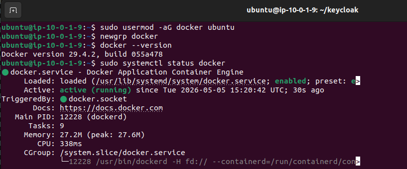
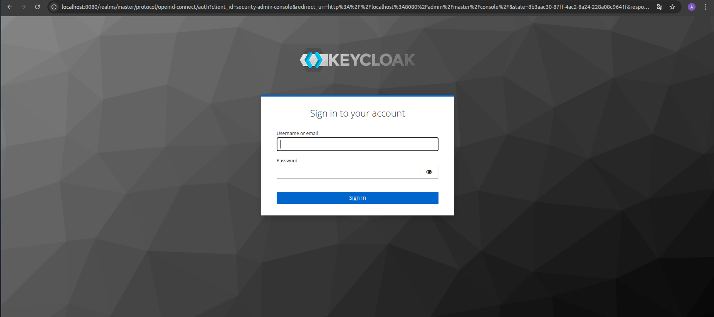
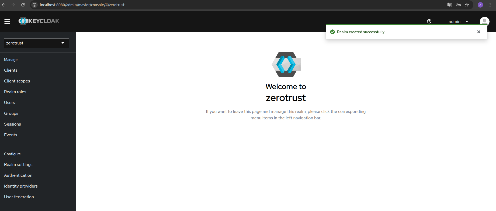
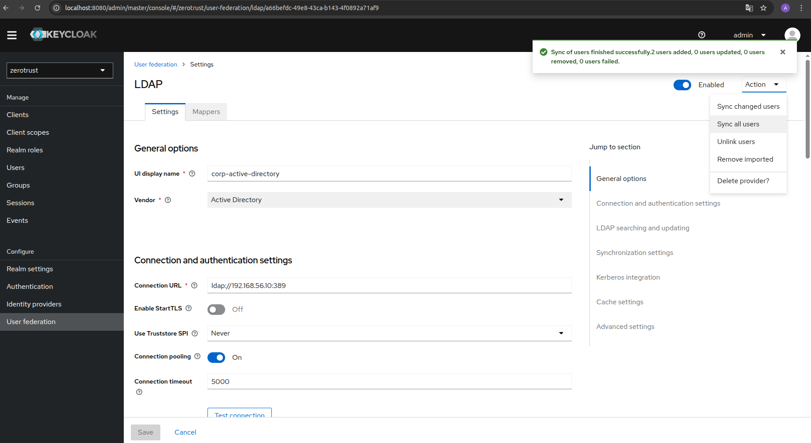
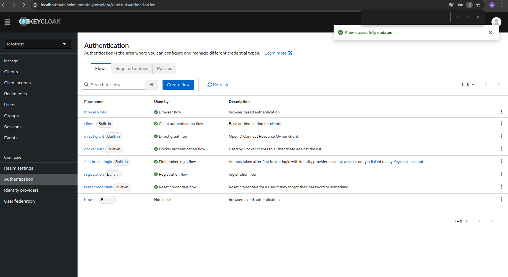
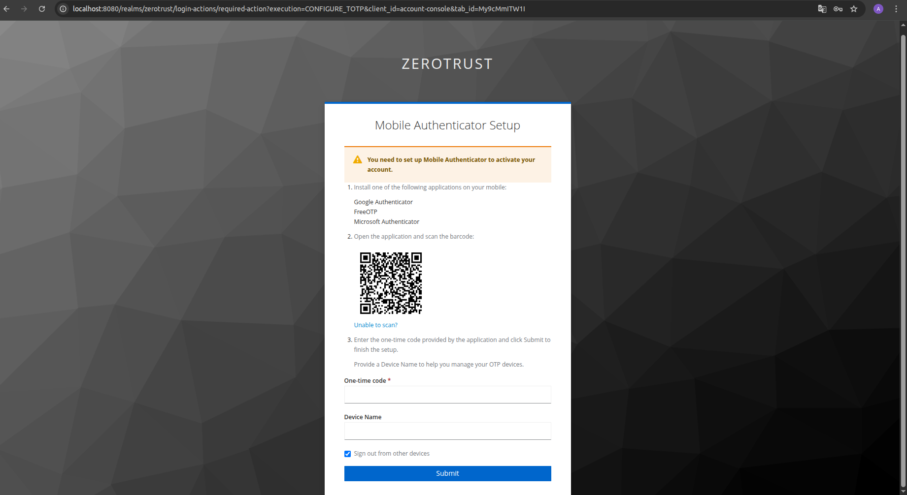
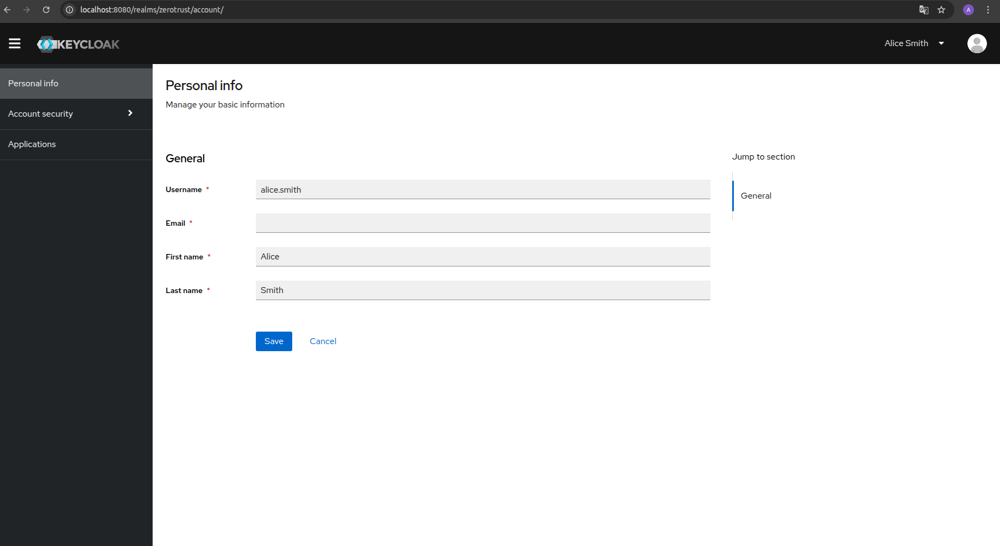

# Keycloak — Identity Provider Deployment

**Project:** Zero Trust Corporate System  
**Author:** Asier Barranco  
**Date:** 05/05/2026  
**Host:** `ztcs-perimeter` — AWS EC2 public subnet  
**Version:** 1.0  

---

## 1. Architecture Role

Keycloak is the identity provider for the entire Zero Trust system. It acts as the central authentication broker between Active Directory (the source of truth for users) and the corporate services (Nextcloud, Mattermost).

Every access request to any corporate service is intercepted by Nginx and redirected to Keycloak for authentication. Keycloak validates the user's credentials against Active Directory via LDAP through the WireGuard tunnel, enforces MFA, and issues tokens (OIDC/SAML) that the services accept.

**Key details:**

| Parameter | Value |
|---|---|
| Host | `ztcs-perimeter` (`10.0.1.9`) |
| Container name | `keycloak` |
| Internal port | `8080` |
| Admin console URL | `http://localhost:8080` (during setup) |
| Production URL | `https://<domain>/auth` (after Nginx + TLS) |
| LDAP source | `ldap://192.168.56.10:389` (via WireGuard) |

---

## 2. Install Docker on ztcs-perimeter

Connect to the perimeter instance:

```bash
ssh -i /media/asier.barranco.7e6/ASIER/labsuser.pem ubuntu@<PERIMETER_PUBLIC_IP>
```

Install Docker:

```bash
sudo apt update
sudo apt install -y ca-certificates curl gnupg
sudo install -m 0755 -d /etc/apt/keyrings
curl -fsSL https://download.docker.com/linux/ubuntu/gpg | sudo gpg --dearmor -o /etc/apt/keyrings/docker.gpg
sudo chmod a+r /etc/apt/keyrings/docker.gpg

echo \
  "deb [arch=$(dpkg --print-architecture) signed-by=/etc/apt/keyrings/docker.gpg] https://download.docker.com/linux/ubuntu \
  $(. /etc/os-release && echo "$VERSION_CODENAME") stable" | \
  sudo tee /etc/apt/sources.list.d/docker.list > /dev/null

sudo apt update
sudo apt install -y docker-ce docker-ce-cli containerd.io docker-compose-plugin
```

Add the ubuntu user to the docker group to avoid using sudo on every command:

```bash
sudo usermod -aG docker ubuntu
newgrp docker
```

Verify Docker is running:

```bash
docker --version
sudo systemctl status docker
```

---

## 3. Deploy Keycloak

Create a directory for Keycloak configuration:

```bash
mkdir -p ~/keycloak
cd ~/keycloak
```

Create the Docker Compose file:

```bash
nano docker-compose.yml
```

Paste the following content:

```yaml
services:
  keycloak:
    image: quay.io/keycloak/keycloak:24.0.4
    container_name: keycloak
    environment:
      KC_DB: dev-file
      KEYCLOAK_ADMIN: admin
      KEYCLOAK_ADMIN_PASSWORD: KeycloakAdmin2026!
      KC_HTTP_ENABLED: "true"
      KC_HOSTNAME_STRICT: "false"
      KC_PROXY: edge
    command: start-dev
    ports:
      - "8080:8080"
    volumes:
      - keycloak_data:/opt/keycloak/data
    restart: unless-stopped

volumes:
  keycloak_data:
```

> `start-dev` mode uses an embedded H2 database suitable for this project. The `KC_PROXY: edge` setting tells Keycloak it is behind a reverse proxy (Nginx), which will be configured in the next phase.

Save with `Ctrl+O` → `Enter` → `Ctrl+X`.

Start Keycloak:

```bash
docker compose up -d
```

Check the container is running:

```bash
docker ps
docker logs keycloak --follow
```

Wait until the logs show:

```
Running the server in development mode.
```

This takes approximately 30–60 seconds on first start.



---

## 4. Verify Keycloak is Accessible

From the `ztcs-perimeter` instance, verify the admin console responds:

```bash
curl -s -o /dev/null -w "%{http_code}" http://localhost:8080/auth/
```

Expected result: `200` or `302`.

Record the admin credentials:

| Parameter | Value |
|---|---|
| Admin URL | `http://localhost:8080` |
| Admin username | `admin` |
| Admin password | `KeycloakAdmin2026!` |

> Add these to your credentials file on the SSD.

To access the Keycloak admin console from your local browser during setup, use an SSH tunnel:

```bash
ssh -i /media/asier.barranco.7e6/ASIER/labsuser.pem -L 8080:localhost:8080 ubuntu@<PERIMETER_PUBLIC_IP>
```

Then open `http://localhost:8080` in your local browser. You will see the Keycloak welcome page.



---

## 5. Create the ZeroTrust Realm

A realm in Keycloak is an isolated authentication domain. All project configuration lives inside a dedicated realm rather than the default `master` realm.

1. Open the Keycloak admin console at `http://localhost:8080`
2. Log in with `admin` / `KeycloakAdmin2026!`
3. Click the dropdown in the top-left corner (shows **master**) → **Create Realm**
4. Set:

| Field | Value |
|---|---|
| Realm name | `zerotrust` |
| Enabled | On |

5. Click **Create**

You are now inside the `zerotrust` realm. All subsequent configuration is done within this realm.



---

## 6. Configure Active Directory Federation (LDAP)

This step connects Keycloak to Active Directory via LDAP through the WireGuard tunnel, synchronising users and enabling domain authentication.

1. In the `zerotrust` realm, go to **User Federation** (left menu)
2. Click **Add provider → ldap**
3. Configure the following settings:

**Connection settings:**

| Field | Value |
|---|---|
| UI display name | `corp-active-directory` |
| Vendor | `Active Directory` |
| Connection URL | `ldap://192.168.56.10:389` |
| Enable StartTLS | Off |
| Use Truststore SPI | Only for StartTLS |
| Connection pooling | On |
| Connection timeout | `5000` |

4. Click **Test connection** — it should return "Successfully connected to LDAP".

**Bind settings:**

| Field | Value |
|---|---|
| Bind type | `simple` |
| Bind DN | `CN=Keycloak Service,OU=ServiceAccounts,OU=ZeroTrust,DC=corp,DC=zerotrust,DC=local` |
| Bind credential | (password set for `svc.keycloak`) |

5. Click **Test authentication** — it should return "Successfully authenticated to LDAP".

**LDAP searching and updating:**

| Field | Value |
|---|---|
| Edit mode | `READ_ONLY` |
| Users DN | `OU=Users,OU=ZeroTrust,DC=corp,DC=zerotrust,DC=local` |
| Username LDAP attribute | `sAMAccountName` |
| RDN LDAP attribute | `cn` |
| UUID LDAP attribute | `objectGUID` |
| User object classes | `person, organizationalPerson, user` |
| User LDAP filter | (leave empty) |
| Search scope | `Subtree` |
| Read timeout | `5000` |
| Pagination | On |

6. Click **Save**

### 6.1 Synchronise Users

After saving, click **Sync all users**. Keycloak will import all users from the `ZeroTrust → Users` OU in Active Directory.

Go to **Users** in the left menu — you should see `alice.smith` and `bob.jones` listed.



---

## 7. Configure MFA (TOTP)

Multi-Factor Authentication is enforced as a required step for all users in the `zerotrust` realm.

1. In the `zerotrust` realm, go to **Authentication** (left menu)
2. Select the **browser** flow
3. Click **Duplicate** → name it `browser-mfa` → **Duplicate**
4. In the duplicated flow, find **Browser - Conditional OTP** → set it to **Required**
5. Go to **Authentication → Bindings** tab
6. Set **Browser Flow** to `browser-mfa`
7. Click **Save**

This ensures every login through the browser flow requires a TOTP code after the password step.



---

## 8. Create Clients for Corporate Services

Keycloak uses **clients** to represent applications that will use SSO. Create one client for Nextcloud.

1. Go to **Clients** (left menu) → **Create client**
2. Configure:

| Field | Value |
|---|---|
| Client type | `SAML` |
| Client ID | `nextcloud` |

3. Click **Next**
4. On the **Login settings** screen:

| Field | Value |
|---|---|
| Root URL | `https://<your-domain>/nextcloud` |
| Valid redirect URIs | `https://<your-domain>/nextcloud/*` |

5. Click **Save**

> Leave `<your-domain>` as a placeholder for now — it will be filled in once the domain and Nginx are configured in the next phase.

---

## 9. Verify Authentication Flow

Test the complete authentication flow with an AD user:

1. Open an SSH tunnel to access Keycloak in the browser:

```bash
ssh -i /media/asier.barranco.7e6/ASIER/labsuser.pem -L 8080:localhost:8080 ubuntu@<PERIMETER_PUBLIC_IP>
```

2. Open `http://localhost:8080/realms/zerotrust/account` in your browser
3. Click **Sign in**
4. Enter credentials: `alice.smith` / `ASzerotrust2026!`
5. Keycloak will prompt to set up TOTP — scan the QR code with an authenticator app (Google Authenticator or similar)
6. Enter the TOTP code to complete setup
7. You should be redirected to the account page successfully




---

## 10. Summary

At the end of this phase, the following is in place:

| Component | Details |
|---|---|
| Docker | Installed on `ztcs-perimeter` |
| Keycloak | Running in Docker — container `keycloak` — port 8080 |
| Realm | `zerotrust` created and active |
| LDAP federation | Connected to `ldap://192.168.56.10:389` via WireGuard |
| Users synced | `alice.smith`, `bob.jones` imported from AD |
| MFA | TOTP required for all users in the `zerotrust` realm |
| SSO client | `nextcloud` client created (placeholder URLs) |

**Next step:** Nginx reverse proxy configuration with TLS certificates.