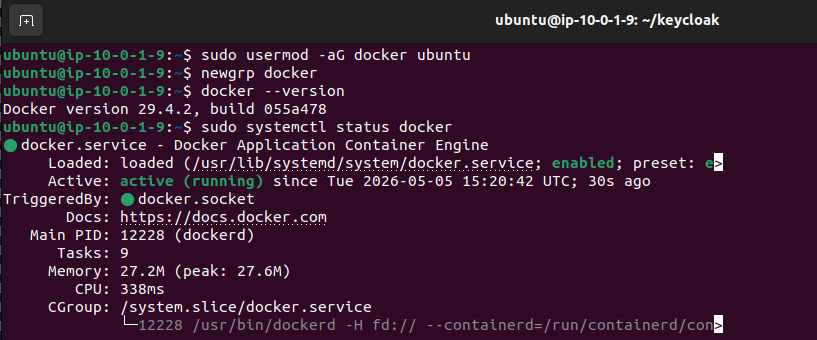
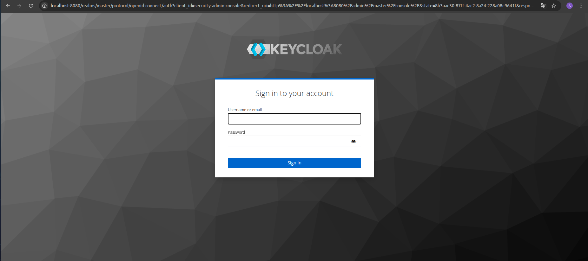
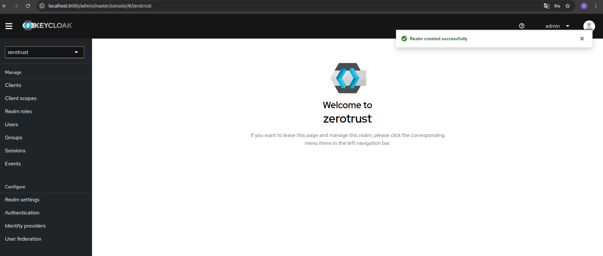
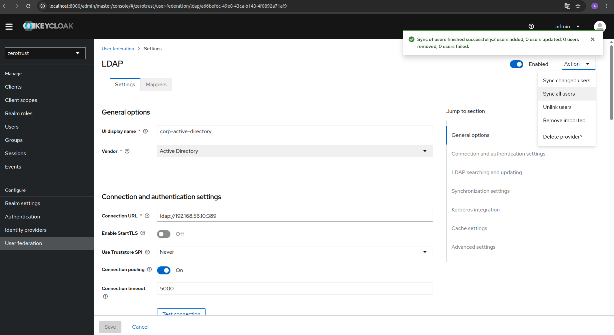
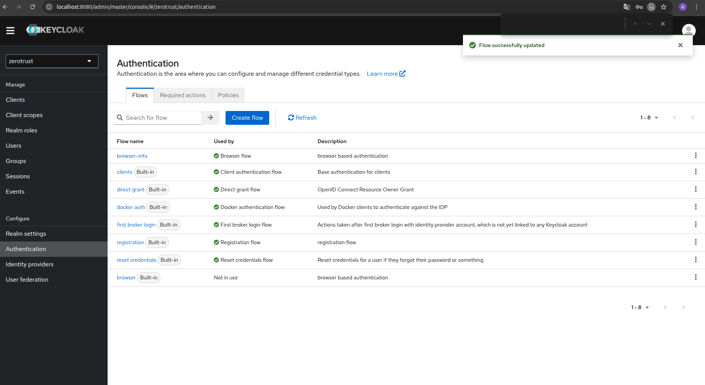
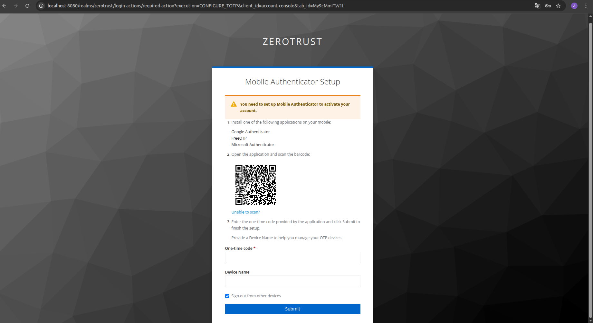
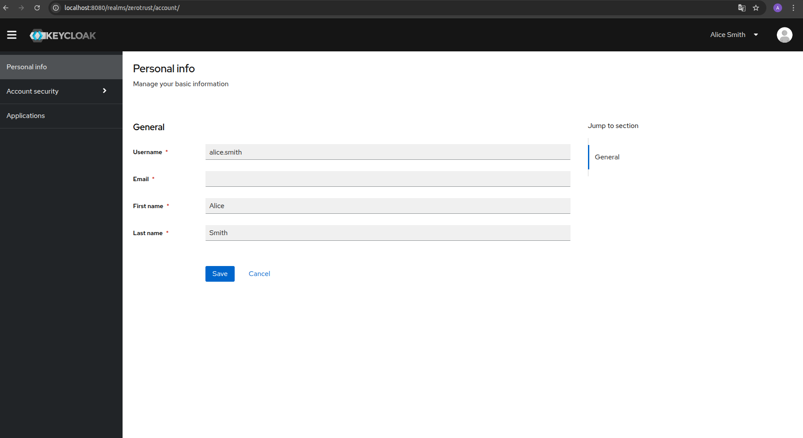

# Keycloak — Identity Provider Deployment

**Project:** Zero Trust Corporate System  
**Author:** Asier Barranco  
**Date:** 05/05/2026  
**Host:** `ztcs-perimeter` — AWS EC2 public subnet  
**Version:** 1.1  

---

## 1. Architecture Role

Keycloak is the central identity provider for the entire Zero Trust system. It acts as the authentication broker between Active Directory — the single source of truth for corporate identities — and the services that users access (Nextcloud, Mattermost).

The authentication flow works as follows: every access request to a corporate service is intercepted by the Nginx reverse proxy and redirected to Keycloak. Keycloak validates the user's credentials against Active Directory via LDAP through the encrypted WireGuard VPN tunnel, enforces Multi-Factor Authentication (TOTP), and upon successful verification issues a security token (OIDC/SAML) that the requesting service accepts to grant access.

No user can reach any corporate resource without completing this full chain: password verification against AD + TOTP code + valid token issuance.

**Key details:**

| Parameter | Value |
|---|---|
| Host instance | `ztcs-perimeter` (`10.0.1.9`) |
| Container name | `keycloak` |
| Internal port | `8080` |
| Keycloak version | `24.0.4` |
| Deployment mode | Docker Compose — development mode with embedded H2 database |
| Admin console | `http://localhost:8080` (accessed via SSH tunnel during setup) |
| Production URL | `https://<domain>/auth` (after Nginx + TLS configuration) |
| LDAP backend | `ldap://192.168.56.10:389` (Active Directory via WireGuard tunnel) |
| Authentication realm | `zerotrust` |
| MFA method | TOTP (Time-based One-Time Password) — required for all users |

---

## 2. Prerequisites

Before starting this deployment, the following must be in place and verified:

| Prerequisite | Status |
|---|---|
| `ztcs-perimeter` EC2 instance running | See `infrastructure/aws/setup.md` |
| WireGuard VPN tunnel active between AWS and DC01 | See `infrastructure/vpn/wireguard-setup.md` |
| Active Directory operational with users synced | See `infrastructure/active-directory/setup.md` |
| LDAP port 389 reachable from `ztcs-perimeter` to `192.168.56.10` | Verified via `nc -zv 192.168.56.10 389` |
| SSH access to `ztcs-perimeter` | Via `labsuser.pem` key |

---

## 3. Install Docker on ztcs-perimeter

Connect to the perimeter instance:

```bash
eval $(ssh-agent)
ssh-add /path/to/labsuser.pem
ssh -i /path/to/labsuser.pem ubuntu@<PERIMETER_PUBLIC_IP>
```

Install Docker from the official repository. The official repository is used instead of the Ubuntu default packages to ensure the latest stable version with Docker Compose plugin support:

```bash
sudo apt update
sudo apt install -y ca-certificates curl gnupg
sudo install -m 0755 -d /etc/apt/keyrings
curl -fsSL https://download.docker.com/linux/ubuntu/gpg | sudo gpg --dearmor -o /etc/apt/keyrings/docker.gpg
sudo chmod a+r /etc/apt/keyrings/docker.gpg

echo \
  "deb [arch=$(dpkg --print-architecture) signed-by=/etc/apt/keyrings/docker.gpg] https://download.docker.com/linux/ubuntu \
  $(. /etc/os-release && echo "$VERSION_CODENAME") stable" | \
  sudo tee /etc/apt/sources.list.d/docker.list > /dev/null

sudo apt update
sudo apt install -y docker-ce docker-ce-cli containerd.io docker-compose-plugin
```

Add the `ubuntu` user to the `docker` group so that Docker commands can be executed without `sudo`:

```bash
sudo usermod -aG docker ubuntu
newgrp docker
```

Verify Docker is installed and running:

```bash
docker --version
sudo systemctl status docker
```

---

## 4. Deploy Keycloak

Create a dedicated directory for the Keycloak deployment:

```bash
mkdir -p ~/keycloak
cd ~/keycloak
```

Create the Docker Compose file:

```bash
nano docker-compose.yml
```

Paste the following content:

```yaml
services:
  keycloak:
    image: quay.io/keycloak/keycloak:24.0.4
    container_name: keycloak
    environment:
      KC_DB: dev-file
      KEYCLOAK_ADMIN: admin
      KEYCLOAK_ADMIN_PASSWORD: <REDACTED — see credentials file>
      KC_HTTP_ENABLED: "true"
      KC_HOSTNAME_STRICT: "false"
      KC_PROXY: edge
    command: start-dev
    ports:
      - "8080:8080"
    volumes:
      - keycloak_data:/opt/keycloak/data
    restart: unless-stopped

volumes:
  keycloak_data:
```

**Environment variables explained:**

| Variable | Purpose |
|---|---|
| `KC_DB: dev-file` | Uses an embedded H2 file-based database — suitable for this project scope |
| `KEYCLOAK_ADMIN` | Admin username for the master realm |
| `KEYCLOAK_ADMIN_PASSWORD` | Admin password — stored in the credentials file on the SSD, not in the repository |
| `KC_HTTP_ENABLED` | Enables HTTP on port 8080 — required because TLS is terminated at the Nginx proxy, not at Keycloak |
| `KC_HOSTNAME_STRICT` | Disabled to allow access from multiple hostnames during development |
| `KC_PROXY: edge` | Tells Keycloak it runs behind a reverse proxy that handles TLS termination |

> **Security note:** the admin password is redacted in the repository version of this file. The actual password is stored exclusively in the local credentials file on the external SSD and must never be committed to version control. On the deployed instance, the actual password is set in the `docker-compose.yml` file.

Save with `Ctrl+O` → `Enter` → `Ctrl+X`.

Start Keycloak:

```bash
docker compose up -d
```

Verify the container is running and healthy:

```bash
docker ps
docker logs keycloak --follow
```

Wait until the logs display the following line, which confirms Keycloak has fully started:

```
Keycloak 24.0.4 on JVM (powered by Quarkus 3.8.4) started in Xs. Listening on: http://0.0.0.0:8080
```

> Warning messages about deprecated `proxy` option, `IndexWrapper` classes, and `XA transaction recovery` are expected in development mode and do not affect functionality.



---

## 5. Access the Admin Console

Keycloak listens on port 8080 which is not exposed to the internet (only port 443 is open in the Security Group). To access the admin console from a local browser, create an SSH tunnel that forwards local port 8080 to the remote instance:

```bash
eval $(ssh-agent)
ssh-add /path/to/labsuser.pem
ssh -L 8080:localhost:8080 ubuntu@<PERIMETER_PUBLIC_IP>
```

With the tunnel active, open `http://localhost:8080` in the local browser. The Keycloak login page will appear.

Log in with the admin credentials:

| Parameter | Value |
|---|---|
| Username | `admin` |
| Password | (see credentials file) |



---

## 6. Create the ZeroTrust Realm

A realm in Keycloak is an isolated authentication domain with its own set of users, clients, roles and authentication policies. All project configuration is created inside a dedicated realm to keep it separated from the default `master` realm, which is reserved for Keycloak administration.

1. In the admin console, click the realm dropdown in the top-left corner (shows **Keycloak**) → **Create Realm**
2. Configure:

| Field | Value |
|---|---|
| Realm name | `zerotrust` |
| Enabled | On |

3. Click **Create**

The console will switch to the `zerotrust` realm. All subsequent configuration steps are performed within this realm.



---

## 7. Configure Active Directory Federation (LDAP)

This is the critical integration step that connects Keycloak to the on-premise Active Directory through the WireGuard VPN tunnel. Once configured, Keycloak can authenticate users against the corporate directory and synchronise their identity attributes.

### 7.1 Create the LDAP Provider

1. In the `zerotrust` realm, go to **User Federation** (left menu)
2. Click **Add provider → ldap**

### 7.2 Connection Settings

| Field | Value |
|---|---|
| UI display name | `corp-active-directory` |
| Vendor | `Active Directory` |
| Connection URL | `ldap://192.168.56.10:389` |
| Enable StartTLS | Off |
| Use Truststore SPI | `Never` |
| Connection pooling | On |
| Connection timeout | `5000` |

Click **Test connection** — expected result: "Successfully connected to LDAP".

> The connection URL uses unencrypted LDAP on port 389. This is acceptable because the traffic travels through the encrypted WireGuard VPN tunnel between `ztcs-perimeter` and `DC01`, providing transport-level encryption. The `Use Truststore SPI` is set to `Never` because StartTLS is disabled.

### 7.3 Bind Settings

| Field | Value |
|---|---|
| Bind type | `simple` |
| Bind DN | `CN=Keycloak Service,OU=ServiceAccounts,OU=ZeroTrust,DC=corp,DC=zerotrust,DC=local` |
| Bind credential | (password for `svc.keycloak` — see credentials file) |

Click **Test authentication** — expected result: "Successfully authenticated to LDAP".

### 7.4 LDAP Searching and Updating

| Field | Value |
|---|---|
| Edit mode | `READ_ONLY` |
| Users DN | `OU=Users,OU=ZeroTrust,DC=corp,DC=zerotrust,DC=local` |
| Username LDAP attribute | `sAMAccountName` |
| RDN LDAP attribute | `cn` |
| UUID LDAP attribute | `objectGUID` |
| User object classes | `person, organizationalPerson, user` |
| User LDAP filter | (empty) |
| Search scope | `Subtree` |
| Read timeout | `5000` |
| Pagination | On |
| Referral | `ignore` |

> `READ_ONLY` mode ensures Keycloak cannot modify Active Directory objects. All user management (creation, password changes, group membership) is performed exclusively in Active Directory.

### 7.5 Synchronisation Settings

| Field | Value |
|---|---|
| Import users | On |
| Sync Registrations | On |
| Periodic full sync | Off |
| Periodic changed users sync | Off |

Click **Save**.

### 7.6 Synchronise Users

After saving, click **Action → Sync all users**. Keycloak imports all user objects from the configured Users DN in Active Directory.

Expected result: "Sync of users finished successfully. 2 users added, 0 users updated, 0 users removed, 0 users failed."

Verify by navigating to **Users** in the left menu — `alice.smith` and `bob.jones` should appear in the user list with their first and last names populated from Active Directory.



---

## 8. Configure MFA (TOTP)

Multi-Factor Authentication is enforced as a mandatory step for every login in the `zerotrust` realm. The chosen method is TOTP (Time-based One-Time Password), compatible with standard authenticator applications such as Google Authenticator, Microsoft Authenticator or FreeOTP.

### 8.1 Duplicate the Browser Flow

1. Go to **Authentication** (left menu) → **Flows** tab
2. In the `browser` flow row, click the three dots menu (`⋮`) → **Duplicate**
3. Name the duplicated flow: `browser-mfa` → click **Duplicate**

### 8.2 Set OTP as Required

1. Open the `browser-mfa` flow
2. Find the step **browser-mfa Browser - Conditional OTP**
3. Change its Requirement from `Conditional` to **Required**

### 8.3 Bind the Flow

1. Return to the **Flows** list (click **Authentication** in the left menu)
2. On the `browser-mfa` row, click the three dots menu (`⋮`) → **Bind flow**
3. Select **Browser flow** → click **Save**

After binding, `browser-mfa` will show "Browser flow" in the Used by column, and the original `browser` flow will show "Not in use".



---

## 9. Create Clients for Corporate Services

Keycloak uses **clients** to represent external applications that delegate authentication to it. Each corporate service that uses SSO needs a corresponding client in Keycloak.

### 9.1 Nextcloud Client

1. Go to **Clients** (left menu) → **Create client**
2. Configure:

| Field | Value |
|---|---|
| Client type | `SAML` |
| Client ID | `nextcloud` |

3. Click **Next**
4. On the **Login settings** screen, leave the URL fields empty for now — they will be configured once the domain and Nginx reverse proxy are in place.
5. Click **Save**

> The Nextcloud client URLs will be updated during the Nginx + TLS configuration phase when the production domain is available.

---

## 10. Verify Authentication Flow

This step validates the entire authentication chain: user credentials verified against Active Directory via LDAP, followed by mandatory TOTP setup and verification.

1. Ensure the SSH tunnel is active for browser access to `http://localhost:8080`
2. Open a new browser tab and navigate to:

```
http://localhost:8080/realms/zerotrust/account
```

3. Click **Sign in**
4. Enter the credentials of an AD user: username `alice.smith`, password as set in Active Directory
5. Keycloak will redirect to the **Mobile Authenticator Setup** page — this confirms that:
   - The user was successfully authenticated against Active Directory via LDAP
   - The MFA requirement is being enforced as configured
6. Scan the QR code with an authenticator app (Google Authenticator, Microsoft Authenticator or FreeOTP)
7. Enter the six-digit TOTP code displayed by the app into the **One-time code** field
8. Set a **Device Name** (e.g. `alice-phone`) and click **Submit**
9. Upon successful TOTP verification, Keycloak redirects to the user's account management page, displaying the user profile imported from Active Directory





This verification confirms the following acceptance criteria:
- **KC-02:** Users from AD are visible in Keycloak after LDAP sync ✓
- **KC-03:** SSO authentication flow works with AD credentials ✓
- **KC-04:** MFA (TOTP) is enforced before access is granted ✓
- **KC-06:** Successful authentication results in a valid session ✓

---

## 11. Summary

At the end of this phase, the following is operational:

| Component | Details |
|---|---|
| Docker | Installed on `ztcs-perimeter` — version 29.4.2 |
| Keycloak | Running in Docker — container `keycloak` — Keycloak 24.0.4 — port 8080 |
| Realm | `zerotrust` — isolated authentication domain |
| LDAP federation | `corp-active-directory` — connected to `ldap://192.168.56.10:389` via WireGuard |
| User synchronisation | `alice.smith`, `bob.jones` imported from AD `OU=Users,OU=ZeroTrust` |
| Authentication flow | `browser-mfa` — bound as Browser flow with TOTP required |
| MFA | TOTP mandatory for all realm users — verified with `alice.smith` |
| SSO client | `nextcloud` (SAML) — placeholder URLs pending Nginx configuration |
| Data persistence | Docker volume `keycloak_data` — survives container restarts |

**Next step:** Nginx reverse proxy configuration with TLS certificates and domain setup.
