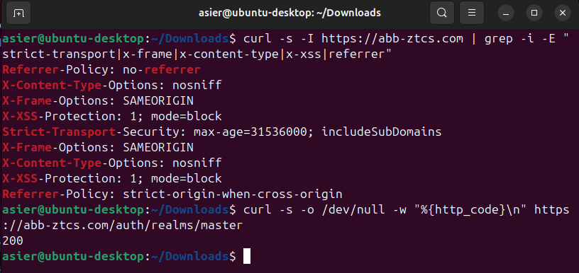

# Nginx Reverse Proxy — TLS Termination & Service Routing

**Project:** Zero Trust Corporate System  
**Author:** Asier Barranco  
**Date:** 07/05/2026  
**Host:** `ztcs-perimeter` — AWS EC2 public subnet  
**Domain:** `abb-ztcs.com`  
**Version:** 2.0  

---

## 1. Architecture Role

Nginx is the single entry point for all external traffic into the Zero Trust architecture. It operates as a reverse proxy on the perimeter instance, accepting HTTPS connections from end users and routing them to the appropriate internal service based on the request path.

No corporate service is accessible directly from the internet. Every request must pass through Nginx, which enforces TLS encryption, applies security headers, and proxies traffic to the backend services.

**Traffic flow:**

```
End User → HTTPS (443) → Nginx (ztcs-perimeter) → HTTP → Backend service
```

**Routing map:**

| URL | Backend target | Service |
|---|---|---|
| `https://abb-ztcs.com/` | `http://10.0.2.220:8080` | Nextcloud |
| `https://abb-ztcs.com/auth/` | `http://localhost:8080/` | Keycloak (same instance) |
| `https://abb-ztcs.com/mattermost/` | `http://10.0.2.220:8065` | Mattermost [OPTIONAL] |

> Keycloak is routed under `/auth/` rather than a custom path. This avoids the need to reconfigure the Keycloak realm, SAML clients and LDAP federation that are already operational — Keycloak's internal routing expects `/auth/` as its default context path.

**Key details:**

| Parameter | Value |
|---|---|
| Host instance | `ztcs-perimeter` (`10.0.1.9`) |
| Public domain | `abb-ztcs.com` |
| Elastic IP | `32.197.108.153` |
| HTTPS port | 443 |
| HTTP port | 80 (redirect to HTTPS only) |
| TLS provider | Let's Encrypt via Certbot |
| Certificate auto-renewal | Certbot timer (systemd) |
| Backend — Nextcloud | `10.0.2.220:8080` |
| Backend — Keycloak | `localhost:8080` |
| Backend — Mattermost | `10.0.2.220:8065` [OPTIONAL] |

---

## 2. Prerequisites

| Prerequisite | Status |
|---|---|
| `ztcs-perimeter` EC2 instance running | See `infrastructure/aws/setup.md` |
| Elastic IP `32.197.108.153` assigned to `ztcs-perimeter` | See `infrastructure/aws/dns-elastic-ip-setup.md` |
| Domain `abb-ztcs.com` registered | DNS A record → `32.197.108.153` |
| DNS propagation complete | `dig abb-ztcs.com` returns `32.197.108.153` |
| Keycloak running on `ztcs-perimeter:8080` | See `infrastructure/identity-provider/setup.md` |
| Corporate services running on `ztcs-services` | See `infrastructure/services/setup.md` |
| Security Group `ztcs-sg-perimeter` | Ports 80 and 443 open to `0.0.0.0/0` |

### 2.1 Verify DNS Before Proceeding

From `ztcs-perimeter`:

```bash
dig abb-ztcs.com +short
```

Expected result: `32.197.108.153`. If this does not return the correct IP, do not proceed — Let's Encrypt certificate issuance will fail because the ACME HTTP-01 challenge requires the domain to resolve to this server.

---

## 3. Install Nginx

Connect to `ztcs-perimeter`:

```bash
ssh -i /path/to/labsuser.pem ubuntu@32.197.108.153
```

Install Nginx:

```bash
sudo apt update
sudo apt install -y nginx
```

Verify Nginx is running:

```bash
sudo systemctl status nginx
```

Verify the default page is reachable from the internet. From your local machine:

```bash
curl -s -o /dev/null -w "%{http_code}\n" http://abb-ztcs.com
```

Expected result: `200`. This confirms that port 80 is open, DNS is resolving correctly, and Nginx is serving traffic.

---

## 4. Obtain TLS Certificates with Certbot

Install Certbot with the Nginx plugin:

```bash
sudo apt install -y certbot python3-certbot-nginx
```

Request a certificate from Let's Encrypt:

```bash
sudo certbot --nginx -d abb-ztcs.com --non-interactive --agree-tos --email admin@abb-ztcs.com --redirect
```

**Flags explained:**

| Flag | Purpose |
|---|---|
| `--nginx` | Automatically configures TLS in the Nginx config |
| `-d abb-ztcs.com` | Domain to issue the certificate for |
| `--non-interactive` | No interactive prompts |
| `--agree-tos` | Accept Let's Encrypt terms of service |
| `--email admin@abb-ztcs.com` | Contact email for certificate expiry notifications |
| `--redirect` | Automatically configure HTTP → HTTPS redirect |

Expected output should include: `Successfully received certificate` and `Deploying certificate to VirtualHost`.

Verify the certificate:

```bash
sudo certbot certificates
```

Verify HTTPS is working from your local machine:

```bash
curl -s -o /dev/null -w "%{http_code}\n" https://abb-ztcs.com
```

Expected result: `200` or `302`.

### 4.1 Verify Auto-Renewal

Certbot installs a systemd timer for automatic renewal. Verify it is active:

```bash
sudo systemctl status certbot.timer
```

Test the renewal process without actually renewing:

```bash
sudo certbot renew --dry-run
```

Expected result: `Congratulations, all simulated renewals succeeded`.

---

## 5. Configure Nginx as Reverse Proxy

Replace the Certbot-generated default configuration with the full reverse proxy configuration.

### 5.1 Create the Server Configuration

```bash
sudo nano /etc/nginx/sites-available/abb-ztcs.com
```

Paste the following content:

```nginx
# ── HTTP — redirect all traffic to HTTPS ─────────────────────────────
server {
    listen 80;
    server_name abb-ztcs.com;
    return 301 https://$host$request_uri;
}

# ── HTTPS — main reverse proxy ───────────────────────────────────────
server {
    listen 443 ssl;
    server_name abb-ztcs.com;

    # ── TLS certificates (managed by Certbot) ────────────────────────
    ssl_certificate /etc/letsencrypt/live/abb-ztcs.com/fullchain.pem;
    ssl_certificate_key /etc/letsencrypt/live/abb-ztcs.com/privkey.pem;
    include /etc/letsencrypt/options-ssl-nginx.conf;
    ssl_dhparam /etc/letsencrypt/ssl-dhparams.pem;

    # ── Security headers ─────────────────────────────────────────────
    add_header Strict-Transport-Security "max-age=31536000; includeSubDomains" always;
    add_header X-Frame-Options "SAMEORIGIN" always;
    add_header X-Content-Type-Options "nosniff" always;
    add_header X-XSS-Protection "1; mode=block" always;
    add_header Referrer-Policy "strict-origin-when-cross-origin" always;

    # ── Nextcloud — root path ────────────────────────────────────────
    location / {
        proxy_pass http://10.0.2.220:8080;
        proxy_set_header Host $host;
        proxy_set_header X-Real-IP $remote_addr;
        proxy_set_header X-Forwarded-For $proxy_add_x_forwarded_for;
        proxy_set_header X-Forwarded-Proto $scheme;

        # Nextcloud large file upload support
        client_max_body_size 10G;
        proxy_request_buffering off;

        # Timeouts for large file operations
        proxy_connect_timeout 300;
        proxy_send_timeout 300;
        proxy_read_timeout 300;
    }

    # ── Keycloak — identity provider ─────────────────────────────────
    location /auth/ {
        proxy_pass http://localhost:8080;
        proxy_set_header Host $host;
        proxy_set_header X-Real-IP $remote_addr;
        proxy_set_header X-Forwarded-For $proxy_add_x_forwarded_for;
        proxy_set_header X-Forwarded-Proto $scheme;
        proxy_set_header X-Forwarded-Host $host;
        proxy_set_header X-Forwarded-Port 443;

        # WebSocket support for Keycloak admin console
        proxy_http_version 1.1;
        proxy_set_header Upgrade $http_upgrade;
        proxy_set_header Connection "upgrade";

        # Buffer sizes for Keycloak token responses
        proxy_buffer_size 128k;
        proxy_buffers 4 256k;
        proxy_busy_buffers_size 256k;
    }

    # ── Mattermost — team communications [OPTIONAL] ──────────────────
    location /mattermost/ {
        proxy_pass http://10.0.2.220:8065/;
        proxy_set_header Host $host;
        proxy_set_header X-Real-IP $remote_addr;
        proxy_set_header X-Forwarded-For $proxy_add_x_forwarded_for;
        proxy_set_header X-Forwarded-Proto $scheme;

        # WebSocket support for Mattermost real-time messaging
        proxy_http_version 1.1;
        proxy_set_header Upgrade $http_upgrade;
        proxy_set_header Connection "upgrade";

        client_max_body_size 50M;
    }
}
```

Save with `Ctrl+O` → `Enter` → `Ctrl+X`.

**Configuration explained:**

| Section | Purpose |
|---|---|
| HTTP server block | Redirects all HTTP traffic to HTTPS with a 301 permanent redirect |
| TLS certificates | Managed by Certbot — auto-renewed every 60 days |
| Security headers | HSTS enforces HTTPS for 1 year; X-Frame-Options prevents clickjacking; X-Content-Type-Options prevents MIME sniffing; X-XSS-Protection enables browser XSS filter; Referrer-Policy controls referrer header leakage |
| Nextcloud location | Root path (`/`) proxied to the private subnet — 10 GB upload limit for file management — extended timeouts for large uploads |
| Keycloak location | `/auth/` proxied to localhost:8080 — WebSocket support for the admin console — enlarged buffers for SAML/OIDC token responses |
| Mattermost location | `/mattermost/` proxied to the private subnet — WebSocket support for real-time messaging — 50 MB upload limit for attachments |

### 5.2 Enable the Configuration

Disable the default site and enable the project configuration:

```bash
sudo rm -f /etc/nginx/sites-enabled/default
sudo ln -s /etc/nginx/sites-available/abb-ztcs.com /etc/nginx/sites-enabled/
```

Test the configuration syntax:

```bash
sudo nginx -t
```

Expected result:

```
nginx: the configuration file /etc/nginx/nginx.conf syntax is ok
nginx: configuration file /etc/nginx/nginx.conf test is successful
```

Reload Nginx to apply:

```bash
sudo systemctl reload nginx
```

---

## 6. Update Keycloak for Proxy Compatibility

Keycloak needs to be informed that it now runs behind a reverse proxy under the `/auth/` path. The current `KC_PROXY: edge` setting is deprecated in Keycloak 24 — it must be replaced with the updated proxy configuration.

Edit the Keycloak Docker Compose file:

```bash
cd ~/keycloak
nano docker-compose.yml
```

Update the environment section — **remove** the line `KC_PROXY: edge` and **add** the following variables:

```yaml
    environment:
      KC_DB: dev-file
      KEYCLOAK_ADMIN: admin
      KEYCLOAK_ADMIN_PASSWORD: <REDACTED — see credentials file>
      KC_HTTP_ENABLED: "true"
      KC_HOSTNAME_STRICT: "false"
      KC_PROXY_HEADERS: xforwarded
      KC_HTTP_RELATIVE_PATH: /auth
```

**New variables explained:**

| Variable | Purpose |
|---|---|
| `KC_PROXY_HEADERS: xforwarded` | Replaces deprecated `KC_PROXY: edge` — tells Keycloak to trust `X-Forwarded-*` headers from Nginx |
| `KC_HTTP_RELATIVE_PATH: /auth` | Sets the base path for all Keycloak endpoints — matches the Nginx `location /auth/` block |

Save and restart Keycloak:

```bash
docker compose down
docker compose up -d
```

Wait approximately 30–60 seconds for Keycloak to start. Check the logs:

```bash
docker logs keycloak --tail 10
```

Wait for the line `Keycloak 24.0.4 on JVM ... started in Xs`.

---

## 7. Verify the Complete Configuration

### 7.1 HTTPS and Certificate

From your local machine:

```bash
curl -I https://abb-ztcs.com 2>&1 | head -5
```

Verify that the response shows `HTTP/2 200` or `HTTP/2 302` with no certificate warnings.

### 7.2 HTTP to HTTPS Redirect

```bash
curl -s -o /dev/null -w "%{http_code}\n" http://abb-ztcs.com
```

Expected: `301`. This confirms that all HTTP traffic is redirected to HTTPS.

### 7.3 Security Headers

```bash
curl -s -I https://abb-ztcs.com | grep -i -E "strict-transport|x-frame|x-content-type|x-xss|referrer"
```

Expected output should include all five security headers:

```
Strict-Transport-Security: max-age=31536000; includeSubDomains
X-Frame-Options: SAMEORIGIN
X-Content-Type-Options: nosniff
X-XSS-Protection: 1; mode=block
Referrer-Policy: strict-origin-when-cross-origin
```



### 7.4 Nextcloud via Proxy

From your local machine:

```bash
curl -s -o /dev/null -w "%{http_code}\n" https://abb-ztcs.com/
```

Expected: `200` or `302`. Open `https://abb-ztcs.com/` in the browser — the Nextcloud login page should appear with a valid TLS certificate and no browser warnings.

### 7.5 Keycloak via Proxy

```bash
curl -s -o /dev/null -w "%{http_code}\n" https://abb-ztcs.com/auth/
```

Expected: `200` or `302`. Open `https://abb-ztcs.com/auth/` in the browser — the Keycloak welcome page or admin console login should appear.

### 7.6 Mattermost via Proxy [OPTIONAL]

```bash
curl -s -o /dev/null -w "%{http_code}\n" https://abb-ztcs.com/mattermost/
```

Expected: `200`. Open `https://abb-ztcs.com/mattermost/` in the browser — the Mattermost interface should appear.

---

## 8. Update SAML Client URLs in Keycloak

Now that Keycloak is accessible at `https://abb-ztcs.com/auth/`, the Nextcloud SAML client that was created with placeholder URLs must be updated.

1. Access the Keycloak admin console at `https://abb-ztcs.com/auth/` (or via SSH tunnel at `http://localhost:8080`)
2. Log in with admin credentials
3. Switch to the `zerotrust` realm
4. Go to **Clients** → click on `nextcloud`
5. Update the Client ID to: `https://abb-ztcs.com`
6. Update the following URLs:

| Field | Value |
|---|---|
| Root URL | `https://abb-ztcs.com` |
| Valid Redirect URIs | `https://abb-ztcs.com/*` |
| Base URL | `https://abb-ztcs.com` |
| Master SAML Processing URL | `https://abb-ztcs.com/apps/user_saml/saml/acs` |

7. In **Logout Settings**:

| Field | Value |
|---|---|
| Logout Service POST Binding URL | `https://abb-ztcs.com/apps/user_saml/saml/sls` |

8. Click **Save**

> These URLs must be exact — mismatches between the Client ID in Keycloak and the SP Entity ID in Nextcloud are the most common cause of SAML authentication failures.

---

## 9. Configuration Files for Repository

The following files should be committed to the repository:

| File | Repository path |
|---|---|
| Nginx server configuration | `infrastructure/reverse-proxy/abb-ztcs.com.conf` |
| This document | `infrastructure/reverse-proxy/nginx-setup.md` |

The Nginx configuration contains no sensitive data — TLS certificate paths reference the standard Let's Encrypt directory managed by Certbot.

---

## 10. Summary

At the end of this phase, the following is operational:

| Component | Details |
|---|---|
| Nginx | Installed on `ztcs-perimeter` — listening on ports 80 and 443 |
| TLS certificate | Issued by Let's Encrypt for `abb-ztcs.com` — auto-renewal via Certbot timer |
| HTTP redirect | All HTTP requests redirected to HTTPS with 301 |
| Security headers | HSTS, X-Frame-Options, X-Content-Type-Options, X-XSS-Protection, Referrer-Policy |
| Nextcloud routing | `https://abb-ztcs.com/` → `http://10.0.2.220:8080` |
| Keycloak routing | `https://abb-ztcs.com/auth/` → `http://localhost:8080` |
| Mattermost routing | `https://abb-ztcs.com/mattermost/` → `http://10.0.2.220:8065` [OPTIONAL] |
| Keycloak proxy config | `KC_PROXY_HEADERS: xforwarded` + `KC_HTTP_RELATIVE_PATH: /auth` |
| SAML client URLs | Updated in Keycloak to use production domain |
| WebSocket support | Enabled for Keycloak and Mattermost |
| File upload limits | 10 GB (Nextcloud), 50 MB (Mattermost) |
| Certificate validity | ~90 days (auto-renewed by Certbot before expiry) |

**Acceptance criteria verified:**
- **NX-01:** All services accessible only through the proxy ✓
- **NX-02:** HTTP redirects to HTTPS with 301 ✓
- **NX-03:** Valid Let's Encrypt certificate, no browser warnings ✓
- **NX-04:** Auto-renewal configured and tested ✓
- **NX-05:** Security headers present ✓
- **NX-06:** Routing to all backend services functional ✓

**Next step:** SSO integration between Nextcloud and Keycloak via SAML. See `infrastructure/services/sso-nextcloud-setup.md`.