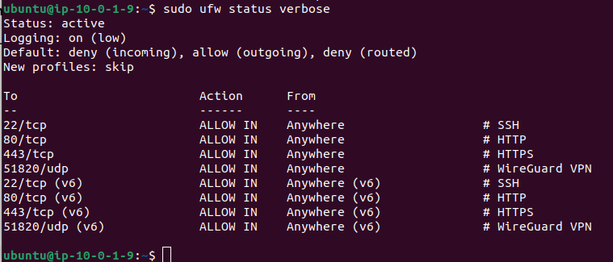
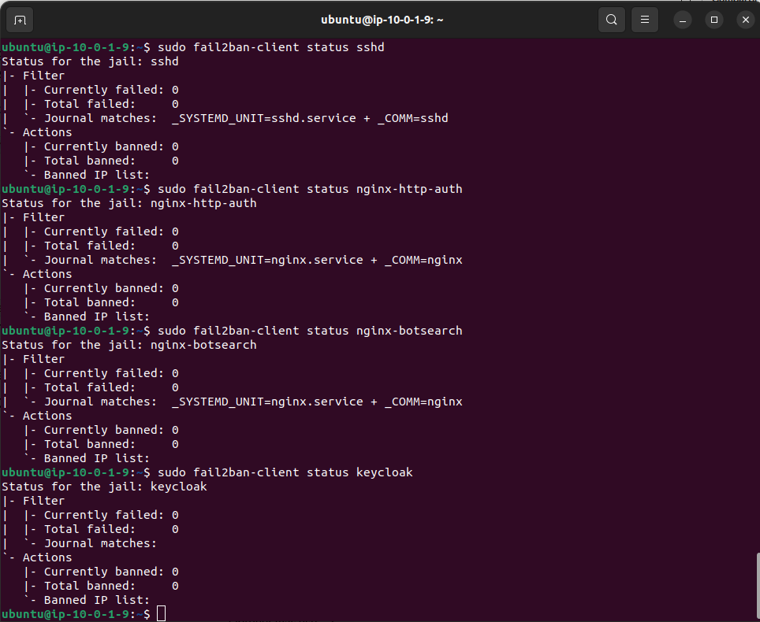

# Perimeter Protection — Fail2ban & UFW

**Project:** Zero Trust Corporate System  
**Author:** Asier Barranco  
**Date:** 05/05/2026  
**Host:** `ztcs-perimeter` — AWS EC2 public subnet  
**Version:** 1.0

---

## 1. Architecture Role

The perimeter instance (`ztcs-perimeter`) is the only publicly accessible server in the entire architecture. It faces the internet directly and handles all incoming traffic before routing it to the internal services. This makes it the primary target for automated attacks such as brute force login attempts, port scanning and credential stuffing.

Two complementary tools provide active defence at the perimeter:

| Tool | Purpose |
|---|---|
| **UFW** (Uncomplicated Firewall) | Host-level firewall that restricts which ports accept traffic — acts as a second layer on top of AWS Security Groups |
| **Fail2ban** | Intrusion prevention daemon that monitors log files and dynamically bans IP addresses that exhibit malicious behaviour |

Together with the AWS Security Groups (which filter at the network level), UFW and Fail2ban create a defence-in-depth strategy: Security Groups filter at the cloud layer, UFW filters at the OS layer, and Fail2ban responds dynamically to attack patterns detected in application logs.

**Key details:**

| Parameter | Value |
|---|---|
| Host | `ztcs-perimeter` (`10.0.1.9`) |
| UFW default policy | Deny incoming, allow outgoing |
| Fail2ban monitored services | SSH, Nginx, Keycloak |
| Ban duration | 1 hour (SSH), 30 minutes (Nginx/Keycloak) |
| Max retries before ban | 3 (SSH), 5 (Nginx/Keycloak) |

---

## 2. Prerequisites

| Prerequisite | Status |
|---|---|
| `ztcs-perimeter` EC2 instance running | See `infrastructure/aws/setup.md` |
| SSH access to `ztcs-perimeter` | Verified |
| Nginx installed and running | See `infrastructure/reverse-proxy/setup.md` |
| Keycloak running on port 8080 | See `infrastructure/identity-provider/setup.md` |

---

## 3. Connect to the Perimeter Instance

```bash
eval $(ssh-agent)
ssh-add /path/to/labsuser.pem
ssh -i /path/to/labsuser.pem ubuntu@<PERIMETER_PUBLIC_IP>
```

---

## 4. Install and Configure UFW

### 4.1 Install UFW

UFW is typically pre-installed on Ubuntu. Verify and install if needed:

```bash
sudo apt update
sudo apt install -y ufw
```

### 4.2 Set Default Policies

```bash
sudo ufw default deny incoming
sudo ufw default allow outgoing
```

This denies all incoming connections by default and allows all outgoing — the most restrictive starting point.

### 4.3 Allow Required Ports

Open only the ports that the perimeter instance needs to accept traffic on:

```bash
# SSH — administrative access
sudo ufw allow 22/tcp comment "SSH"

# HTTP — Let's Encrypt ACME validation and HTTPS redirect
sudo ufw allow 80/tcp comment "HTTP"

# HTTPS — all production traffic through Nginx
sudo ufw allow 443/tcp comment "HTTPS"

# WireGuard — VPN tunnel to on-premise DC01
sudo ufw allow 51820/udp comment "WireGuard VPN"
```

> Port 8080 (Keycloak) is intentionally NOT opened in UFW. Keycloak is accessed only through the Nginx reverse proxy on port 443, or via SSH tunnel during administration. Direct access to port 8080 from the internet is blocked.

### 4.4 Enable UFW

```bash
sudo ufw enable
```

When prompted with "Command may disrupt existing ssh connections", type `y` and press Enter. The current SSH session will not be interrupted because port 22 was allowed in the previous step.

### 4.5 Verify UFW Status

```bash
sudo ufw status verbose
```

Expected output:

```
Status: active
Logging: on (low)
Default: deny (incoming), allow (outgoing), disabled (routed)
New profiles: skip

To                         Action      From
--                         ------      ----
22/tcp                     ALLOW IN    Anywhere                   # SSH
80/tcp                     ALLOW IN    Anywhere                   # HTTP
443/tcp                    ALLOW IN    Anywhere                   # HTTPS
51820/udp                  ALLOW IN    Anywhere                   # WireGuard VPN
22/tcp (v6)                ALLOW IN    Anywhere (v6)              # SSH
80/tcp (v6)                ALLOW IN    Anywhere (v6)              # HTTP
443/tcp (v6)               ALLOW IN    Anywhere (v6)              # HTTPS
51820/udp (v6)             ALLOW IN    Anywhere (v6)              # WireGuard VPN
```



---

## 5. Install and Configure Fail2ban

### 5.1 Install Fail2ban

```bash
sudo apt install -y fail2ban
```

### 5.2 Create the Local Configuration

Fail2ban uses a layered configuration system. The main config file (`jail.conf`) should never be edited directly — all customisations go in `jail.local` which overrides the defaults.

```bash
sudo nano /etc/fail2ban/jail.local
```

Paste the following configuration:

```ini
[DEFAULT]
# Ban duration: 1 hour by default
bantime = 3600
# Time window to count failures
findtime = 600
# Ignore the loopback address
ignoreip = 127.0.0.1/8 10.0.0.0/16 10.10.0.0/24 192.168.56.0/24
# Action: ban via UFW instead of raw iptables
banaction = ufw

# ── SSH Protection ───────────────────────────────────────────────────
[sshd]
enabled = true
port = ssh
filter = sshd
logpath = /var/log/auth.log
maxretry = 3
bantime = 3600
findtime = 600

# ── Nginx HTTP Auth Protection ───────────────────────────────────────
[nginx-http-auth]
enabled = true
port = http,https
filter = nginx-http-auth
logpath = /var/log/nginx/error.log
maxretry = 5
bantime = 1800
findtime = 300

# ── Nginx Bad Requests Protection ────────────────────────────────────
[nginx-botsearch]
enabled = true
port = http,https
filter = nginx-botsearch
logpath = /var/log/nginx/access.log
maxretry = 5
bantime = 1800
findtime = 300

# ── Keycloak Brute Force Protection ──────────────────────────────────
[keycloak]
enabled = true
filter = keycloak
backend = systemd
journalmatch = CONTAINER_TAG=keycloak
maxretry = 5
findtime = 60
bantime = 1800
banaction = ufw
```

**Configuration explained:**

| Parameter | Value | Purpose |
|---|---|---|
| `bantime` | 3600 (SSH) / 1800 (others) | Duration in seconds that an IP is banned — 1 hour for SSH, 30 minutes for web |
| `findtime` | 600 (SSH) / 300 (others) | Time window in seconds to count failures — 10 minutes for SSH, 5 minutes for web |
| `maxretry` | 3 (SSH) / 5 (others) | Number of failures before ban — stricter for SSH |
| `ignoreip` | Local + VPC + VPN + host-only | Prevents banning internal IPs — VPC range, WireGuard tunnel and VirtualBox host-only network |
| `banaction` | `ufw` | Uses UFW to enforce bans — integrates with the firewall already in place |

Save with `Ctrl+O` → `Enter` → `Ctrl+X`.

### 5.3 Create the Keycloak Filter

Fail2ban needs a custom filter to detect failed Keycloak login attempts from the Nginx access log. Create the filter file:

```bash
sudo nano /etc/fail2ban/filter.d/keycloak.conf
```

Paste the following content:

```ini
[Definition]
failregex = .*ipAddress=\"<HOST>\".*error=\"(invalid_user_credentials|not_allowed|cookie_not_found)\"
ignoreregex =
```

Save with `Ctrl+O` → `Enter` → `Ctrl+X`.

> This filter watches for POST requests to the Keycloak authentication endpoint that result in 401 (Unauthorized) or 403 (Forbidden) responses. These indicate failed login attempts. The `<HOST>` placeholder is replaced by Fail2ban with the client IP address from the log line.

### 5.4 Verify the Keycloak Filter Syntax

```bash
sudo fail2ban-regex "journalmatch:CONTAINER_TAG=keycloak" /etc/fail2ban/filter.d/keycloak.conf
```

> If the Nginx access log does not exist yet (Nginx not yet configured), this command will show an error — that is expected. The filter will work once Nginx is running and generating logs. You can re-run this verification after the Nginx deployment.

### 5.5 Start and Enable Fail2ban

```bash
sudo systemctl enable fail2ban
sudo systemctl start fail2ban
```

### 5.6 Verify Fail2ban Status

```bash
sudo systemctl status fail2ban
sudo fail2ban-client status
```

Expected output of `fail2ban-client status`:

```
Status
|- Number of jail:      4
`- Jail list:   keycloak, nginx-botsearch, nginx-http-auth, sshd
```

Check individual jail status:

```bash
sudo fail2ban-client status sshd
```

Expected output:

```
Status for the jail: sshd
|- Filter
|  |- Currently failed: 0
|  |- Total failed:     0
|  `- File list:        /var/log/auth.log
`- Actions
   |- Currently banned: 0
   |- Total banned:     0
   `- Banned IP list:
```



---

## 6. Test the SSH Jail

To verify Fail2ban is actively protecting SSH, perform a controlled test from a separate machine or IP:

> **Warning:** do NOT test from your current SSH session. If you get banned, you will lose access to the instance. Use a different network or device for this test.

From a different device or network, attempt to SSH with an incorrect key or password multiple times. After 3 failed attempts within 10 minutes, the IP should be banned.

To check if the ban was applied:

```bash
sudo fail2ban-client status sshd
```

The banned IP should appear in the `Banned IP list`.

To manually unban an IP (if needed during testing):

```bash
sudo fail2ban-client set sshd unbanip <IP_ADDRESS>
```

---

## 7. Useful Operational Commands

### View all active bans across all jails

```bash
sudo fail2ban-client status sshd
sudo fail2ban-client status nginx-http-auth
sudo fail2ban-client status nginx-botsearch
sudo fail2ban-client status keycloak
```

### Manually ban an IP

```bash
sudo fail2ban-client set sshd banip <IP_ADDRESS>
```

### Manually unban an IP

```bash
sudo fail2ban-client set sshd unbanip <IP_ADDRESS>
```

### View Fail2ban log

```bash
sudo tail -f /var/log/fail2ban.log
```

### Reload Fail2ban after configuration changes

```bash
sudo fail2ban-client reload
```

### View UFW rules including Fail2ban bans

```bash
sudo ufw status numbered
```

---

## 8. Configuration Files for Repository

The following files should be committed to the repository with the configuration as documented:

| File | Repository path |
|---|---|
| `jail.local` | `infrastructure/reverse-proxy/fail2ban/jail.local` |
| `keycloak.conf` | `infrastructure/reverse-proxy/fail2ban/keycloak.conf` |

These are configuration files with no sensitive data — they can be committed without redaction.

---

## 9. Integration with Purple Team

The Fail2ban configuration deployed in this phase is directly tested during the Purple Team exercises:

| Attack | Fail2ban jail tested | Expected behaviour |
|---|---|---|
| Attack 1 — Brute force SSH | `sshd` | IP banned after 3 failed SSH attempts |
| Attack 2 — Credential theft (Keycloak) | `keycloak` | IP banned after 5 failed login attempts |
| Attack 1 — Brute force HTTP | `nginx-http-auth` | IP banned after 5 failed HTTP auth attempts |

The Blue Team documentation will reference these jails and include evidence of bans triggered during the attack simulations.

---

## 10. Summary

At the end of this phase, the following perimeter protections are active:

| Component | Details |
|---|---|
| UFW | Active — default deny incoming, allow outgoing |
| UFW allowed ports | 22/tcp (SSH), 80/tcp (HTTP), 443/tcp (HTTPS), 51820/udp (WireGuard) |
| Fail2ban | Active — 4 jails enabled |
| Jail — sshd | 3 retries, 10 min window, 1 hour ban |
| Jail — nginx-http-auth | 5 retries, 5 min window, 30 min ban |
| Jail — nginx-botsearch | 5 retries, 5 min window, 30 min ban |
| Jail — keycloak | 5 retries, 5 min window, 30 min ban — custom filter |
| Ban enforcement | Via UFW — integrates with the host firewall |
| Ignored IPs | Localhost, VPC range, WireGuard tunnel, host-only network |
| Defence layers | AWS Security Groups → UFW → Fail2ban (defence-in-depth) |