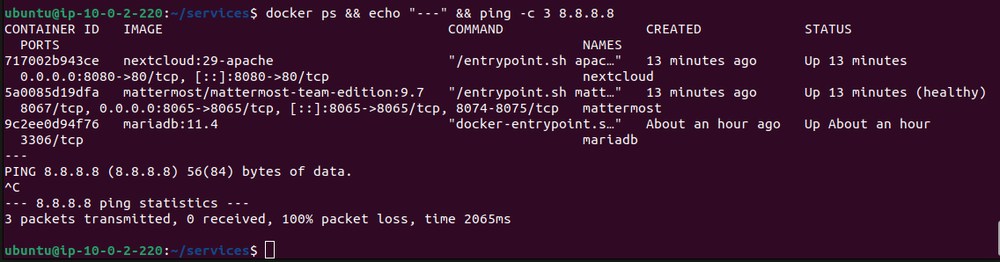

# Corporate Services Deployment — MariaDB, Nextcloud & Mattermost

**Project:** Zero Trust Corporate System  
**Author:** Asier Barranco  
**Date:** 05/05/2026  
**Host:** `ztcs-services` — AWS EC2 private subnet  
**Version:** 1.0

---

## 1. Architecture Role

The services instance (`ztcs-services`) hosts all corporate applications and their shared database in Docker containers within the private subnet. These services are never exposed directly to the internet — all user traffic reaches them exclusively through the Nginx reverse proxy on `ztcs-perimeter`.

The three services deployed are:

| Service | Purpose | Port (internal) |
|---|---|---|
| MariaDB | Relational database backend for Nextcloud and Mattermost | 3306 |
| Nextcloud | Corporate document management system | 8080 |
| Mattermost | Corporate team communications platform [OPTIONAL] | 8065 |

All three run in a single Docker Compose stack sharing an internal Docker network. Only the Nginx reverse proxy on `ztcs-perimeter` can reach the application ports — the Security Group `ztcs-sg-services` enforces this restriction at the AWS level.

**Key details:**

| Parameter | Value |
|---|---|
| Host instance | `ztcs-services` (`10.0.2.220`) |
| Docker Compose location | `~/services/docker-compose.yml` |
| Internal Docker network | `ztcs-internal` |
| Database | MariaDB 11.4 |
| Document management | Nextcloud 29 (Apache variant) |
| Communications | Mattermost 9.7 |
| Data persistence | Docker volumes for each service |

---

## 2. Prerequisites

| Prerequisite | Status |
|---|---|
| `ztcs-services` EC2 instance running | See `infrastructure/aws/setup.md` |
| `ztcs-perimeter` EC2 instance running | Required for SSH jump access |
| SSH access via jump host through `ztcs-perimeter` | Verified |
| Security Group `ztcs-sg-services` configured | Ports 80, 8065, 8080, 3306 restricted to `ztcs-sg-perimeter` |

---

## 3. Enable Temporary Internet Access on the Private Subnet

By design, the private subnet has no internet routing. For the initial deployment, a temporary NAT Gateway is created to allow `ztcs-services` to download Docker packages and pull container images. This gateway is removed immediately after deployment to restore the air-gapped architecture.

> **Cost note:** a NAT Gateway costs approximately $0.045/hour plus data transfer. If created and removed within the same work session (~2-3 hours), the total cost is under $0.50.

### 3.1 Create a NAT Gateway

1. In the AWS console, go to **VPC → NAT Gateways → Create NAT Gateway**
2. Configure:

| Field | Value |
|---|---|
| Name | `ztcs-nat-temp` |
| Subnet | `ztcs-public-subnet` |
| Connectivity type | Public |
| Elastic IP | Click **Allocate Elastic IP** |

3. Click **Create NAT Gateway**
4. Wait approximately 1-2 minutes until the status changes to **Available**

### 3.2 Add a Route to the Private Route Table

1. Go to **VPC → Route Tables**
2. Select the default route table for `ztcs-vpc` (the one associated with the private subnet — not `ztcs-public-rt`)
3. Go to the **Routes** tab → click **Edit routes**
4. Click **Add route**:

| Destination | Target |
|---|---|
| `0.0.0.0/0` | NAT Gateway → `ztcs-nat-temp` |

5. Click **Save changes**

### 3.3 Verify Internet Access on ztcs-services

Connect to `ztcs-services` via jump host:

```bash
eval $(ssh-agent)
ssh-add /path/to/labsuser.pem
ssh -A -J ubuntu@<PERIMETER_PUBLIC_IP> ubuntu@10.0.2.220
```

Verify internet access:

```bash
ping -c 4 8.8.8.8
ping -c 4 google.com
```

Both should succeed. If they do not, verify the NAT Gateway is in `Available` state and the route is correctly added to the private route table.

---

## 4. Install Docker on ztcs-services

With internet access now available, Docker can be installed directly from the official repository:

```bash
sudo apt update
sudo apt install -y ca-certificates curl gnupg
sudo install -m 0755 -d /etc/apt/keyrings
curl -fsSL https://download.docker.com/linux/ubuntu/gpg | sudo gpg --dearmor -o /etc/apt/keyrings/docker.gpg
sudo chmod a+r /etc/apt/keyrings/docker.gpg

echo \
  "deb [arch=$(dpkg --print-architecture) signed-by=/etc/apt/keyrings/docker.gpg] https://download.docker.com/linux/ubuntu \
  $(. /etc/os-release && echo "$VERSION_CODENAME") stable" | \
  sudo tee /etc/apt/sources.list.d/docker.list > /dev/null

sudo apt update
sudo apt install -y docker-ce docker-ce-cli containerd.io docker-compose-plugin
```

Add the `ubuntu` user to the `docker` group:

```bash
sudo usermod -aG docker ubuntu
newgrp docker
```

Verify Docker is installed and running:

```bash
docker --version
sudo systemctl status docker
```

---

## 5. Create the Docker Compose Stack

Create the services directory and compose file:

```bash
mkdir -p ~/services
cd ~/services
nano docker-compose.yml
```

Paste the following content:

```yaml
services:

  # ── MariaDB — Shared relational database ──────────────────────────
  mariadb:
    image: mariadb:11.4
    container_name: mariadb
    environment:
      MYSQL_ROOT_PASSWORD: XXXXXXXXXXX
      MYSQL_DATABASE: nextcloud
      MYSQL_USER: nextcloud_user
      MYSQL_PASSWORD: XXXXXXXXXX
    volumes:
      - mariadb_data:/var/lib/mysql
    networks:
      - ztcs-internal
    restart: unless-stopped
    command: >
      --character-set-server=utf8mb4
      --collation-server=utf8mb4_unicode_ci
      --default-authentication-plugin=mysql_native_password
      --bind-address=0.0.0.0
      --skip-name-resolve

  # ── Nextcloud — Document management ────────────────────────────────
  nextcloud:
    image: nextcloud:29-apache
    container_name: nextcloud
    environment:
      MYSQL_HOST: mariadb
      MYSQL_DATABASE: nextcloud
      MYSQL_USER: nextcloud_user
      MYSQL_PASSWORD: XXXXXXXXXX
      NEXTCLOUD_ADMIN_USER: nc_admin
      NEXTCLOUD_ADMIN_PASSWORD: XXXXXXXXXX
      NEXTCLOUD_TRUSTED_DOMAINS: "abb-ztcs.com"
      OVERWRITEPROTOCOL: https
    volumes:
      - nextcloud_data:/var/www/html
    ports:
      - "8080:80"
    networks:
      - ztcs-internal
    depends_on:
      - mariadb
    restart: unless-stopped

  # ── Mattermost — Team communications [OPTIONAL] ───────────────────
  mattermost:
    image: mattermost/mattermost-team-edition:9.7
    container_name: mattermost
    environment:
      MM_SQLSETTINGS_DRIVERNAME: mysql
      MM_SQLSETTINGS_DATASOURCE: "mattermost_user:<REDACTED>@tcp(mariadb:3306)/mattermost?charset=utf8mb4,utf8&writeTimeout=30s"
      MM_SERVICESETTINGS_SITEURL: "https://abb-ztcs.com/mattermost"
      MM_SERVICESETTINGS_LISTENADDRESS: ":8065"
    volumes:
      - mattermost_data:/mattermost/data
      - mattermost_config:/mattermost/config
      - mattermost_logs:/mattermost/logs
      - mattermost_plugins:/mattermost/plugins
    ports:
      - "8065:8065"
    networks:
      - ztcs-internal
    depends_on:
      - mariadb
    restart: unless-stopped

networks:
  ztcs-internal:
    driver: bridge

volumes:
  mariadb_data:
  nextcloud_data:
  mattermost_data:
  mattermost_config:
  mattermost_logs:
  mattermost_plugins:
```

**Environment variables explained:**

| Service | Variable | Purpose |
|---|---|---|
| MariaDB | `MYSQL_ROOT_PASSWORD` | Root database password — used only for initial setup and administration |
| MariaDB | `MYSQL_DATABASE` / `MYSQL_USER` / `MYSQL_PASSWORD` | Nextcloud database and dedicated user — created automatically on first start |
| Nextcloud | `MYSQL_HOST: mariadb` | Resolves to the MariaDB container via Docker internal DNS |
| Nextcloud | `NEXTCLOUD_ADMIN_USER` / `NEXTCLOUD_ADMIN_PASSWORD` | Nextcloud local admin account — used for initial configuration |
| Nextcloud | `NEXTCLOUD_TRUSTED_DOMAINS` | Domain name allowed to access Nextcloud — prevents host header attacks |
| Nextcloud | `OVERWRITEPROTOCOL: https` | Tells Nextcloud that TLS is terminated at the proxy — generates HTTPS URLs |
| Mattermost | `MM_SQLSETTINGS_DATASOURCE` | Full connection string to the Mattermost database in MariaDB |
| Mattermost | `MM_SERVICESETTINGS_SITEURL` | Public URL of the Mattermost instance — used for link generation |

> **Security note:** all passwords are redacted in the repository version of this file. Actual passwords are stored exclusively in the local credentials file on the external SSD. On the deployed instance, the actual values are set directly in the `docker-compose.yml`.

> **Domain placeholder:** replace all instances of `<your-domain>` with the actual domain once it is purchased and configured. Until then, the services are accessible internally via SSH tunnels but SSO integration will not function.

Save with `Ctrl+O` → `Enter` → `Ctrl+X`.

---

## 6. Create the Mattermost Database

The Docker Compose file automatically creates the Nextcloud database on first start via the `MYSQL_DATABASE` environment variable. However, the Mattermost database must be created manually.

Start only MariaDB first:

```bash
docker compose up -d mariadb
```

Wait approximately 10-15 seconds for the database to initialise. Check the logs to confirm it is ready:

```bash
docker logs mariadb --tail 5
```

Look for the line: `ready for connections` or `mariadbd: ready for connections`.

Connect to MariaDB and create the Mattermost database and user:

```bash
docker exec -it mariadb mariadb -u root -p
```

Enter the MariaDB root password when prompted. Then execute the following SQL:

```sql
CREATE DATABASE mattermost CHARACTER SET utf8mb4 COLLATE utf8mb4_unicode_ci;
CREATE USER 'mattermost_user'@'%' IDENTIFIED BY '<MATTERMOST_DB_PASSWORD>';
GRANT ALL PRIVILEGES ON mattermost.* TO 'mattermost_user'@'%';
FLUSH PRIVILEGES;
EXIT;
```

> Replace `<MATTERMOST_DB_PASSWORD>` with the actual password and record it in the credentials file. This password must match the one in the `MM_SQLSETTINGS_DATASOURCE` connection string in the compose file.

---

## 7. Start All Services

```bash
cd ~/services
docker compose up -d
```

Verify all three containers are running:

```bash
docker ps
```

Expected output:

| Container | Image | Ports | Status |
|---|---|---|---|
| `mariadb` | mariadb:11.4 | 3306/tcp | Up |
| `nextcloud` | nextcloud:29-apache | 0.0.0.0:8080→80/tcp | Up |
| `mattermost` | mattermost/mattermost-team-edition:9.7 | 0.0.0.0:8065→8065/tcp | Up |

Check logs for errors:

```bash
docker logs mariadb --tail 20
docker logs nextcloud --tail 20
docker logs mattermost --tail 20
```

No `ERROR` or `FATAL` messages should appear. Warning messages about first-time initialisation are expected.



---

## 8. Remove Temporary Internet Access

Now that all packages are installed and Docker images are pulled, the temporary NAT Gateway must be removed to restore the air-gapped architecture of the private subnet.

### 8.1 Remove the Route

1. Go to **VPC → Route Tables**
2. Select the default route table for `ztcs-vpc` (the private subnet table)
3. Go to **Routes** tab → **Edit routes**
4. Delete the `0.0.0.0/0 → NAT Gateway` route
5. Click **Save changes**

### 8.2 Delete the NAT Gateway

1. Go to **VPC → NAT Gateways**
2. Select `ztcs-nat-temp`
3. Click **Actions → Delete NAT Gateway** → confirm

### 8.3 Release the Elastic IP

1. Go to **VPC → Elastic IPs**
2. Find the Elastic IP that was allocated for the NAT Gateway (it will show as "not associated")
3. Select it → **Actions → Release Elastic IP addresses** → confirm

> Releasing the Elastic IP is important — an unassociated Elastic IP incurs charges.

### 8.4 Verify Isolation is Restored

From `ztcs-services`:

```bash
ping -c 4 8.8.8.8
```

Expected result: **no response** (100% packet loss). This confirms the private subnet is once again air-gapped from the public internet.

---

## 9. Verify MariaDB Hardening

### 9.1 Verify dedicated users

```bash
docker exec -it mariadb mysql -u root -p -e "SELECT user, host FROM mysql.user;"
```

Expected output should show `root` (localhost only), `nextcloud_user` and `mattermost_user`.

---

## 10. Verify Nextcloud

From `ztcs-perimeter`, verify Nextcloud responds:

```bash
curl -s -o /dev/null -w "%{http_code}" http://10.0.2.220:8080
```

Expected result: `200` or `302`.

---

## 11. Verify Mattermost

From `ztcs-perimeter`, verify Mattermost responds:

```bash
curl -s -o /dev/null -w "%{http_code}" http://10.0.2.220:8065
```

Expected result: `200`.

---

## 12. Verify External Isolation

From your local machine (not through SSH), attempt to access the services directly:

```bash
curl -s --connect-timeout 5 http://<PERIMETER_PUBLIC_IP>:8080
curl -s --connect-timeout 5 http://<PERIMETER_PUBLIC_IP>:8065
curl -s --connect-timeout 5 http://<PERIMETER_PUBLIC_IP>:3306
```

Expected result for all three: **connection timeout** or **connection refused**. This confirms that corporate services are not accessible from the public internet — satisfying acceptance criteria NC-04, MM-04 and E2E-03.

---

## 13. Summary

At the end of this phase, the following is operational:

| Component | Details |
|---|---|
| Docker | Installed on `ztcs-services` via temporary NAT Gateway internet access |
| MariaDB | Running — container `mariadb` — port 3306 — MariaDB 11.4 |
| Nextcloud | Running — container `nextcloud` — port 8080 → 80 — Nextcloud 29 |
| Mattermost | Running — container `mattermost` — port 8065 — Mattermost 9.7 [OPTIONAL] |
| Docker network | `ztcs-internal` — bridge network isolating all three services |
| Data persistence | Docker volumes for all services — survives container restarts |
| Database users | `nextcloud_user`, `mattermost_user` — dedicated, least privilege |
| Root remote access | Disabled — root accessible only from localhost within the container |
| NAT Gateway | Created for deployment, removed after — private subnet restored to air-gapped |
| External isolation | Verified — services not reachable from public internet |
| Internal connectivity | Verified — services reachable from `ztcs-perimeter` on configured ports |