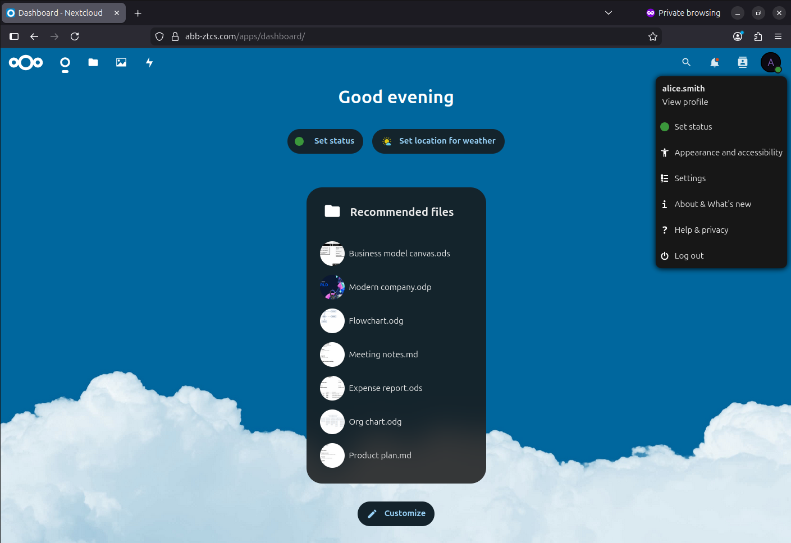

# SSO Integration — Nextcloud with Keycloak (SAML)

**Project:** Zero Trust Corporate System
**Author:** Asier Barranco
**Date:** 11/05/2026
**Version:** 2.0

---

## 1. Architecture Role

Single Sign-On (SSO) connects Nextcloud to the centralised identity provider (Keycloak). Once configured, users authenticate once through Keycloak — which validates their credentials against Active Directory via LDAP and enforces MFA — and gain access to Nextcloud without entering credentials again.

The integration uses the **SAML 2.0** protocol. The authentication flow:

1. User navigates to `https://abb-ztcs.com`
2. Nginx forwards the request to Nextcloud on `ztcs-services`
3. Nextcloud detects unauthenticated session and redirects to Keycloak
4. Keycloak presents the login form
5. User enters Active Directory credentials
6. Keycloak validates against AD via LDAP through the WireGuard tunnel
7. Keycloak enforces TOTP (MFA)
8. Keycloak issues a signed SAML assertion and redirects back to Nextcloud
9. Nextcloud validates the assertion, creates session, and user accesses the dashboard

**Key details:**

| Parameter | Value |
|---|---|
| Protocol | SAML 2.0 |
| Identity Provider (IdP) | Keycloak — realm `zerotrust` |
| Service Provider (SP) | Nextcloud 29 |
| IdP Entity ID | `https://abb-ztcs.com/auth/realms/zerotrust` |
| SP Entity ID | `https://abb-ztcs.com` |
| Username attribute | `urn:oid:0.9.2342.19200300.100.1.1` (uid OID) |
| UID mapping | `urn:oid:0.9.2342.19200300.100.1.1` |

---

## 2. Prerequisites

| Prerequisite | Status |
|---|---|
| Nextcloud deployed and accessible | See `infrastructure/services/setup.md` |
| Keycloak deployed with realm `zerotrust` | See `infrastructure/identity-provider/setup.md` |
| LDAP federation active — `alice.smith`, `bob.jones` synced | Verified |
| Nginx configured with TLS for `abb-ztcs.com` | See `infrastructure/reverse-proxy/nginx-setup.md` |
| Keycloak SAML client `https://abb-ztcs.com` created with correct URLs | Done during Nginx phase |
| DC01 running and WireGuard tunnel active | Required for LDAP authentication during verification |

> **Important:** SSO requires Nginx and TLS to be fully operational before starting. DC01 must be running during the SSO verification step — Keycloak needs LDAP access to Active Directory to authenticate users.

---

## 3. Configure the Keycloak SAML Client

All Keycloak configuration in this phase is performed via the REST API from `ztcs-perimeter`. This is required because Keycloak 24 has a known bug where the Client Scopes tab fails to load for SAML clients in the admin console.

### 3.1 Obtain an Admin Token

Connect to `ztcs-perimeter` and obtain an API token:

```bash
set +H
TOKEN=$(curl -s -X POST http://localhost:8080/auth/realms/master/protocol/openid-connect/token \
  -H "Content-Type: application/x-www-form-urlencoded" \
  -d "username=admin&password=KeycloakAdmin2026%21&grant_type=password&client_id=admin-cli" \
  | grep -o '"access_token":"[^"]*"' | cut -d'"' -f4)
echo $TOKEN | head -c 20
```

The token starts with `eyJ`. Extend the token lifetime to 1 hour to avoid repeated expiry during configuration:

```bash
curl -s -X PUT \
  http://localhost:8080/auth/admin/realms/master \
  -H "Authorization: Bearer $TOKEN" \
  -H "Content-Type: application/json" \
  -d '{"accessTokenLifespan": 3600}'
```

Regenerate the token after this change.

### 3.2 Get the SAML Client Internal ID

```bash
CLIENT_ID=$(curl -s -H "Authorization: Bearer $TOKEN" \
  http://localhost:8080/auth/admin/realms/zerotrust/clients \
  | grep -o '"id":"[^"]*","clientId":"https://abb-ztcs.com"' \
  | cut -d'"' -f4)
echo $CLIENT_ID
```

### 3.3 Configure Signature Settings in the Admin Console

In the Keycloak admin console at `https://abb-ztcs.com/auth/` → realm `zerotrust` → **Clients** → `https://abb-ztcs.com`:

- **Settings tab:** set **Sign Assertions** to **On**
- **Keys tab:** set **Client Signature Required** to **Off**

Click **Save**.

> These two settings are critical: Keycloak must sign its assertions (so Nextcloud can verify them), but Nextcloud does not sign its requests (which Keycloak must accept).

### 3.4 Remove the role_list Default Scope

The `role_list` scope is automatically assigned to SAML clients and causes a `Found an Attribute element with duplicated Name` error in Nextcloud. Remove it:

```bash
ROLE_LIST_ID=$(curl -s -H "Authorization: Bearer $TOKEN" \
  http://localhost:8080/auth/admin/realms/zerotrust/client-scopes \
  | grep -o '"id":"[^"]*","name":"role_list"' | cut -d'"' -f4)

curl -s -X DELETE \
  "http://localhost:8080/auth/admin/realms/zerotrust/clients/$CLIENT_ID/default-client-scopes/$ROLE_LIST_ID" \
  -H "Authorization: Bearer $TOKEN"
```

### 3.5 Create the Username Attribute Mapper

Create a mapper that sends the Keycloak username field using the standard uid OID. Using a URI Reference nameformat avoids conflicts with Nextcloud's SAML attribute parser:

```bash
curl -s -X POST \
  http://localhost:8080/auth/admin/realms/zerotrust/clients/$CLIENT_ID/protocol-mappers/models \
  -H "Authorization: Bearer $TOKEN" \
  -H "Content-Type: application/json" \
  -d '{
    "name": "saml-username",
    "protocol": "saml",
    "protocolMapper": "saml-user-property-mapper",
    "consentRequired": false,
    "config": {
      "user.attribute": "username",
      "attribute.name": "urn:oid:0.9.2342.19200300.100.1.1",
      "attribute.nameformat": "URI Reference",
      "friendly.name": "uid"
    }
  }'
```

Verify:

```bash
curl -s -H "Authorization: Bearer $TOKEN" \
  http://localhost:8080/auth/admin/realms/zerotrust/clients/$CLIENT_ID/protocol-mappers/models \
  | grep -o '"name":"[^"]*"'
```

Expected output: `"name":"saml-username"`

---

## 4. Install the SAML App in Nextcloud

The `ztcs-services` instance has no internet access by default. A temporary NAT Gateway is required to download the app. See `infrastructure/services/setup.md` section 3 for the NAT Gateway procedure.

With internet access enabled on `ztcs-services`, connect via jump host and install:

```bash
docker exec -u 33 -it nextcloud php occ app:install user_saml
docker exec -u 33 -it nextcloud php occ app:enable user_saml
```

Verify:

```bash
docker exec -u 33 -it nextcloud php occ app:list | grep saml
```

Expected: `- user_saml: 6.x.x`

Remove the NAT Gateway after installation. See `infrastructure/services/setup.md` section 8.

---

## 5. Configure SAML in Nextcloud

All Nextcloud SAML configuration is performed via the `occ` CLI on `ztcs-services`. This avoids browser-based configuration issues and ensures reproducibility.

### 5.1 Create the SAML Provider

```bash
docker exec -u 33 -it nextcloud php occ saml:config:create
```

Returns `1` — the provider ID used in all subsequent commands.

### 5.2 Configure IdP and SP Settings

```bash
docker exec -u 33 -it nextcloud php occ saml:config:set \
  --idp-entityId="https://abb-ztcs.com/auth/realms/zerotrust" \
  --idp-singleSignOnService.url="https://abb-ztcs.com/auth/realms/zerotrust/protocol/saml" \
  --idp-singleLogoutService.url="https://abb-ztcs.com/auth/realms/zerotrust/protocol/saml" \
  --general-uid_mapping="urn:oid:0.9.2342.19200300.100.1.1" \
  --sp-entityId="https://abb-ztcs.com" \
  --security-wantAssertionsSigned=1 \
  1
```

### 5.3 Set the IdP X.509 Certificate

Extract the certificate from Keycloak (run on `ztcs-perimeter`):

```bash
curl -s http://localhost:8080/auth/realms/zerotrust/protocol/saml/descriptor | \
  grep -oP '(?<=<ds:X509Certificate>).*(?=</ds:X509Certificate>)'
```

Save to a file on `ztcs-services` to avoid shell escaping issues with special characters (`+`, `=`):

```bash
cat > /tmp/cert.txt << 'EOF'
<PASTE_CERTIFICATE_HERE>
EOF
```

Apply:

```bash
docker exec -u 33 -it nextcloud php occ saml:config:set \
  --idp-x509cert="$(cat /tmp/cert.txt)" \
  1
```

### 5.4 Enable SAML as Authentication Type

```bash
docker exec -u 33 -it nextcloud php occ config:app:set user_saml type --value="saml"
```

### 5.5 Verify the Full Configuration

```bash
docker exec -u 33 -it nextcloud php occ saml:config:get --providerId=1
```

Verify all values are present: `idp-entityId`, `sp-entityId`, `general-uid_mapping`, `security-wantAssertionsSigned`, and `idp-x509cert`.

---

## 6. Verify the SSO Flow

> **Requirement:** DC01 must be running and the WireGuard tunnel must be active before testing. Verify with `nc -zv 192.168.56.10 389` from `ztcs-perimeter`.

### 6.1 Test Authentication

1. Open a **private/incognito browser window**
2. Navigate to `https://abb-ztcs.com`
3. Nextcloud redirects automatically to Keycloak at `https://abb-ztcs.com/auth/`
4. Enter: `alice.smith` / `ASzerotrust2026!`
5. Keycloak prompts for TOTP — enter the 6-digit code from the authenticator app
6. Upon successful MFA, the browser redirects back to Nextcloud
7. The Nextcloud dashboard appears at `https://abb-ztcs.com/apps/dashboard/`



### 6.2 Local Admin Access

When SAML is enabled, all logins redirect to Keycloak. To access the local `nc_admin` account:

```
https://abb-ztcs.com/login?direct=1
```

Bookmark this URL — it is the only way to reach the Nextcloud admin panel without going through SAML.

> **Emergency recovery:** if SAML is misconfigured and access is lost:
>
> ```bash
> docker exec -u 33 -it nextcloud php occ app:disable user_saml
> ```

---

## 7. Troubleshooting Reference

| Error | Cause | Fix |
|---|---|---|
| `SigAlg was null` | Keycloak requires signed SAML requests but Nextcloud sends none | Set **Client Signature Required** to **Off** in Keycloak client Keys tab |
| `Found an Attribute element with duplicated Name` | `role_list` scope sends duplicate attributes | Remove `role_list` from default client scopes (section 3.4) |
| `IDP parameter for the UID not found. Possible parameters are: []` | No attribute mapper or wrong uid_mapping value | Create the `saml-username` mapper (section 3.5) and set `uid_mapping` to the OID |
| `Account not provisioned` | UID mapping attribute name mismatch between Keycloak mapper and Nextcloud config | Both must use `urn:oid:0.9.2342.19200300.100.1.1` |
| `Invalid user credentials` | DC01 is not running or WireGuard tunnel is down | Start DC01 and verify `nc -zv 192.168.56.10 389` succeeds from `ztcs-perimeter` |
| `Internal Server Error` — assertion not signed | Sign Assertions is Off in Keycloak | Set **Sign Assertions** to **On** in Keycloak client settings |

---

## 8. Summary

At the end of this phase, the following SSO integration is operational:

| Component | Details |
|---|---|
| Protocol | SAML 2.0 |
| Identity Provider | Keycloak — realm `zerotrust` — entity `https://abb-ztcs.com/auth/realms/zerotrust` |
| Service Provider | Nextcloud 29 — entity `https://abb-ztcs.com` |
| Username attribute | `urn:oid:0.9.2342.19200300.100.1.1` mapped from Keycloak `username` field |
| Client signature | SP → IdP: unsigned. IdP → SP: signed and verified |
| role_list scope | Removed from client — prevented duplicate attribute error |
| Authentication flow | Nextcloud → Keycloak → AD/LDAP → TOTP → SAML assertion → Nextcloud session |
| Local admin access | Preserved via `https://abb-ztcs.com/login?direct=1` |
| Verified users | `alice.smith` — full SSO + MFA flow completed, dashboard accessible |

**Next step:** Purple Team attack simulations. See `security/red-team/`.