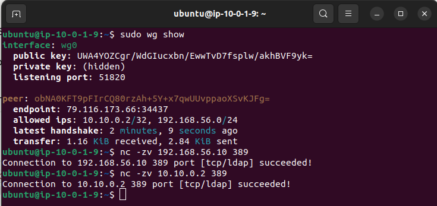
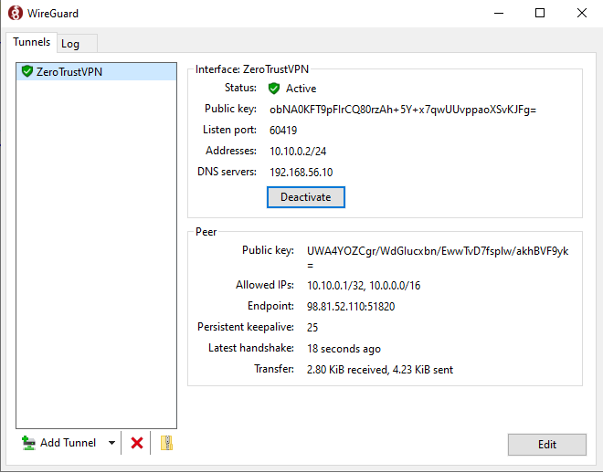

# WireGuard VPN Tunnel — On-premise ↔ AWS

**Project:** Zero Trust Corporate System
**Author:** Asier Barranco
**Date:** 05/05/2026
**Version:** 1.0

---

## 1. Architecture Role

The WireGuard tunnel creates an encrypted point-to-point connection between the on-premise Active Directory domain controller (`DC01`, `192.168.56.10`) and the AWS perimeter EC2 instance (`ztcs-perimeter`, `10.0.1.9`).

This tunnel is a critical dependency for the entire identity layer. Without it, Keycloak cannot reach Active Directory via LDAP, and the SSO federation cannot function.

| Parameter | On-premise (DC01) | AWS (ztcs-perimeter) |
|---|---|---|
| Host | `192.168.56.10` | `10.0.1.9` (private) / dynamic public IP |
| WireGuard interface | `wg0` | `wg0` |
| WireGuard IP | `10.10.0.2/24` | `10.10.0.1/24` |
| Listen port | `51820` | `51820` |

> The `10.10.0.0/24` range is used exclusively for the WireGuard tunnel. It is separate from both the VirtualBox host-only range (`192.168.56.0/24`) and the AWS VPC ranges (`10.0.0.0/16`).

---

## 2. Install WireGuard on the AWS Perimeter Instance

Connect to `ztcs-perimeter` via SSH:

```bash
ssh -i /media/asier.barranco.7e6/ASIER/labsuser.pem ubuntu@<PERIMETER_PUBLIC_IP>
```

Install WireGuard:

```bash
sudo apt update && sudo apt install -y wireguard
```

---

## 3. Generate Keys on the AWS Perimeter Instance

Generate the server key pair:

```bash
wg genkey | sudo tee /etc/wireguard/server_private.key | wg pubkey | sudo tee /etc/wireguard/server_public.key
```

Read and record both values — you will need the public key when configuring the Windows side:

```bash
sudo cat /etc/wireguard/server_private.key
sudo cat /etc/wireguard/server_public.key
```

Set correct permissions:

```bash
sudo chmod 600 /etc/wireguard/server_private.key
```

---

## 4. Create the WireGuard Configuration on AWS

Create the configuration file:

```bash
sudo nano /etc/wireguard/wg0.conf
```

Paste the following content, replacing `<SERVER_PRIVATE_KEY>` with the value from the previous step and `<WINDOWS_PUBLIC_KEY>` with the key generated in step 6:

```ini
[Interface]
PrivateKey = <SERVER_PRIVATE_KEY>
Address = 10.10.0.1/24
ListenPort = 51820

# Enable IP forwarding for routing between tunnel and VPC
PostUp = iptables -A FORWARD -i wg0 -j ACCEPT; iptables -A FORWARD -o wg0 -j ACCEPT; iptables -t nat -A POSTROUTING -o ens5 -j MASQUERADE
PostDown = iptables -D FORWARD -i wg0 -j ACCEPT; iptables -D FORWARD -o wg0 -j ACCEPT; iptables -t nat -D POSTROUTING -o ens5 -j MASQUERADE

[Peer]
# DC01 — on-premise Windows Server
PublicKey = <WINDOWS_PUBLIC_KEY>
AllowedIPs = 10.10.0.2/32, 192.168.56.0/24
```

> `ens5` is the default network interface name on AWS Ubuntu 24.04 instances. Verify with `ip link show` if unsure.

Enable IP forwarding permanently:

```bash
echo "net.ipv4.ip_forward = 1" | sudo tee -a /etc/sysctl.conf
sudo sysctl -p
```

---

## 5. Install WireGuard on Windows Server (DC01)

On the Windows Server VM, download and install WireGuard for Windows:

1. Open **Microsoft Edge** inside the VM
2. Navigate to: `https://www.wireguard.com/install/`
3. Download **Windows installer (amd64)**
4. Run the installer and complete the installation with default options

> If copy-paste between host and VM is not working, type the URL manually or use the NAT adapter internet access that is available on the VM.

---

## 6. Generate Keys on Windows

Open **WireGuard** application → click **Add Tunnel → Add empty tunnel**.

WireGuard will automatically generate a key pair and display the public key at the top of the editor window.

**Record the public key shown** — this is the `<WINDOWS_PUBLIC_KEY>` value needed in the AWS configuration file (step 4).

The editor will show a pre-filled configuration. Replace the entire content with the following, filling in the values:

```ini
[Interface]
PrivateKey = <AUTO_GENERATED_PRIVATE_KEY>
Address = 10.10.0.2/24
DNS = 192.168.56.10

[Peer]
# ztcs-perimeter — AWS EC2
PublicKey = <AWS_SERVER_PUBLIC_KEY>
Endpoint = <PERIMETER_PUBLIC_IP>:51820
AllowedIPs = 10.10.0.1/32, 10.0.0.0/16
PersistentKeepalive = 25
```

Replace:
- `<AUTO_GENERATED_PRIVATE_KEY>` — leave the value WireGuard pre-filled (do not change it)
- `<AWS_SERVER_PUBLIC_KEY>` — the public key from `/etc/wireguard/server_public.key` on the AWS instance
- `<PERIMETER_PUBLIC_IP>` — the current public IP of `ztcs-perimeter`

Name the tunnel: `ZeroTrust-VPN` → click **Save**.

---

## 7. Complete the AWS Configuration

Now that you have the Windows public key, go back to the AWS instance and complete the `wg0.conf` file by replacing `<WINDOWS_PUBLIC_KEY>` with the actual value from step 6.

Edit the file:

```bash
sudo nano /etc/wireguard/wg0.conf
```

After editing, start WireGuard on AWS and enable it on boot:

```bash
sudo systemctl enable wg-quick@wg0
sudo systemctl start wg-quick@wg0
```

Verify the service is running:

```bash
sudo systemctl status wg-quick@wg0
```

---

## 8. Start the Tunnel on Windows

In the WireGuard application on the Windows Server VM, select the `ZeroTrust-VPN` tunnel and click **Activate**.

The tunnel status should change to **Active** within a few seconds.

---

## 9. Verify the Tunnel

### 9.1 On AWS — verify handshake and LDAP connectivity

```bash
sudo wg show
nc -zv 192.168.56.10 389
nc -zv 10.10.0.2 389
```

Expected results:
- `wg show` reports a recent handshake and non-zero transfer values
- Both `nc` commands return `Connection to X port [tcp/ldap] succeeded!`

> Note: ICMP (ping) is blocked by the Windows Firewall by default. TCP connectivity via `nc` is a more reliable verification method and confirms that Keycloak will be able to reach Active Directory via LDAP through the tunnel.



### 9.2 On Windows — verify tunnel status

In the WireGuard application on DC01, the `ZeroTrust-VPN` tunnel should show:
- **Status:** Active
- **Latest handshake:** a recent timestamp
- **Transfer:** non-zero bytes received and sent



### 9.3 Additional configuration applied

During setup, the following additional steps were required to enable routing between the WireGuard tunnel interface and the host-only network adapter:

```powershell
# Enable IP forwarding on all interfaces
Set-NetIPInterface -Forwarding Enabled

# Make IP forwarding persistent across reboots
Set-ItemProperty -Path "HKLM:\SYSTEM\CurrentControlSet\Services\Tcpip\Parameters" -Name "IPEnableRouter" -Value 1

# Add static route from tunnel to host-only network
route add 10.10.0.0 mask 255.255.255.0 192.168.56.1 -p
```

These steps are not in the original WireGuard documentation but are required when the VPN peer runs on a Windows Server with multiple network adapters.
---

## 10. Important — Public IP Changes

The AWS perimeter instance gets a new public IP every time it starts. This means the `Endpoint` value in the Windows WireGuard configuration becomes stale after each lab session restart.

**At the start of every work session:**

1. Note the new public IP of `ztcs-perimeter` from the EC2 console
2. Open the WireGuard application on DC01
3. Click **Edit** on the `ZeroTrust-VPN` tunnel
4. Update the `Endpoint` line with the new IP
5. Click **Save** → **Activate**

This will be resolved permanently once an Elastic IP is assigned to `ztcs-perimeter` during the Nginx and domain configuration phase.

---

## 11. Summary

At the end of this phase, the following is in place:

| Component | Details |
|---|---|
| WireGuard on AWS | Installed on `ztcs-perimeter` — interface `wg0` — IP `10.10.0.1/24` |
| WireGuard on Windows | Installed on `DC01` — tunnel `ZeroTrust-VPN` — IP `10.10.0.2/24` |
| Tunnel status | Active — handshake verified |
| Bidirectional connectivity | AWS ↔ DC01 ping verified |
| LDAP reachability | Port 389 reachable from `ztcs-perimeter` to `192.168.56.10` |

**Next step:** Keycloak identity provider deployment on `ztcs-perimeter`.