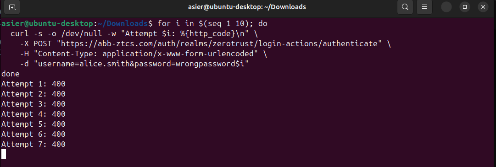
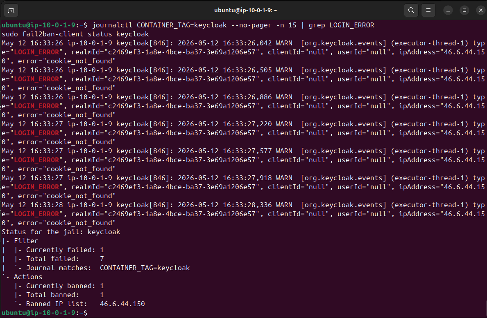
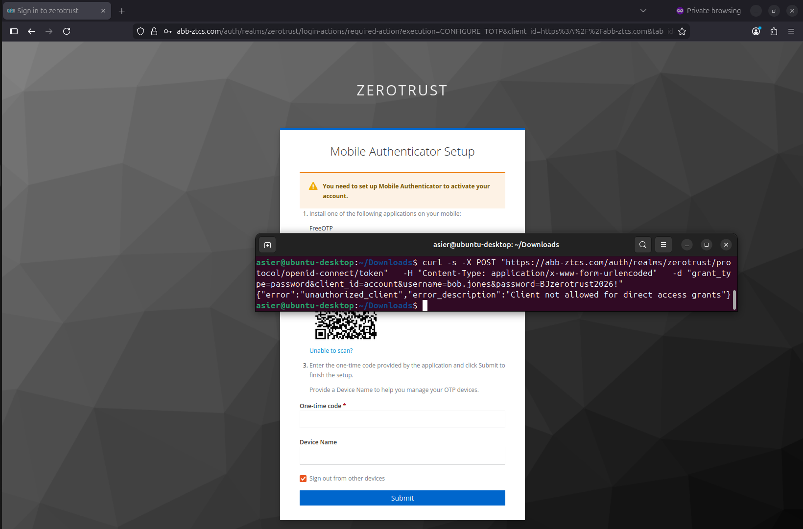
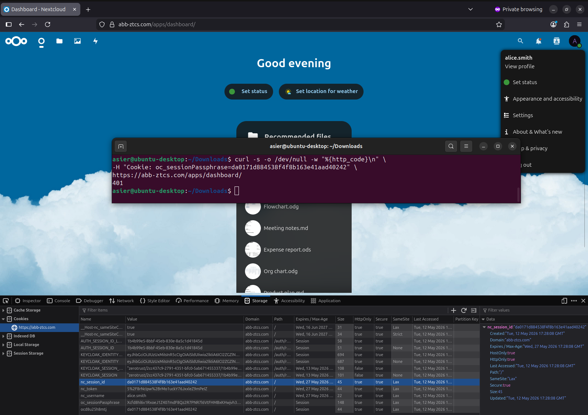
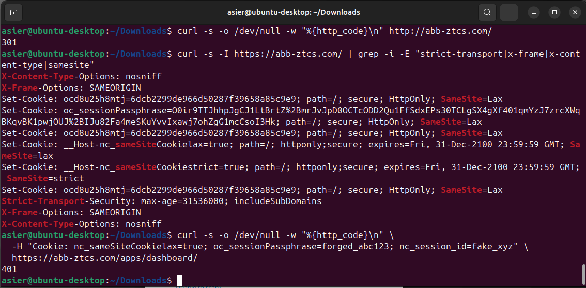

# Purple Team — Attack Simulations & Incident Response

**Project:** Zero Trust Corporate System  
**Author:** Asier Barranco  
**Date:** 11/05/2026  
**Version:** 1.1

---

## 1. Purpose and Methodology

This document records the Purple Team exercises performed against the Zero Trust corporate system. The objective is to validate that the deployed security controls effectively detect, block and respond to realistic attack scenarios.

Each exercise follows the same structure:

1. **Red Team** — execute a controlled attack simulation against the system
2. **Blue Team** — verify that the security controls detected and mitigated the attack
3. **Evidence** — document the commands executed, the system response, and the logs that prove the control worked

The three attack scenarios tested are:

| Attack | Target | Security control tested |
|---|---|---|
| Attack 1 — Brute force | SSH + Keycloak login | SSH key-only authentication (hardening), Fail2ban keycloak jail |
| Attack 2 — Credential theft | Keycloak login with stolen password | MFA (TOTP) repudiation — valid password rejected without second factor |
| Attack 3 — Session hijacking | Nextcloud active session | HTTPS enforcement, secure cookie attributes, session binding |

**Tools used:**

| Tool | Purpose |
|---|---|
| Hydra | Brute force attack tool for SSH |
| curl | Manual HTTP request crafting for credential and session attacks |
| Fail2ban | Intrusion prevention — dynamic IP banning |
| Keycloak | MFA enforcement — TOTP as second factor |
| Nginx | TLS termination, security headers, secure cookies |

> **Important:** all attacks are executed from a controlled environment against the project's own infrastructure. No third-party systems are targeted.

---

## 2. Prerequisites

| Prerequisite | Status |
|---|---|
| All services running (Nginx, Keycloak, Nextcloud, MariaDB) | Verified |
| Fail2ban active with 4 jails | See `infrastructure/reverse-proxy/perimeter-protection-setup.md` |
| DC01 running with WireGuard tunnel active | Required for LDAP authentication |
| Hydra installed on the attacking machine | `sudo apt install -y hydra` |
| SSH access to `ztcs-perimeter` for log verification | Verified |

### 2.1 Pre-attack Verification

Before starting, verify all security controls are active on `ztcs-perimeter`:

```bash
sudo ufw status verbose
sudo fail2ban-client status
sudo systemctl status nginx
docker ps | grep keycloak
```

All must show active/running status.

---

## 3. Attack 1 — Brute Force

### 3.1 Objective

Simulate automated brute force attacks against the SSH service and the Keycloak authentication portal. Verify that SSH key-only authentication blocks password-based attacks by design, and that Fail2ban detects repeated failed Keycloak login attempts and dynamically bans the attacking IP.

### 3.2 Red Team — SSH Brute Force

From the attacking machine, attempt a brute force attack against SSH using Hydra:

```bash
hydra -l ubuntu -P /tmp/wordlist.txt ssh://32.197.108.153 -t 4 -V -f
```

**Expected result:** the SSH server rejects password authentication by design — only public key authentication is accepted. This is a hardening measure that prevents brute force against SSH entirely. Hydra confirms:

```
[ERROR] target ssh://32.197.108.153:22/ does not support password authentication
```

No Fail2ban ban is triggered because the attack is rejected at the protocol level before any authentication attempt is logged.

### 3.3 Red Team — Keycloak Login Brute Force

Simulate repeated failed login attempts against the Keycloak authentication endpoint:

```bash
for i in $(seq 1 10); do
  curl -s -o /dev/null -w "Attempt $i: %{http_code}\n" \
    -X POST "https://abb-ztcs.com/auth/realms/zerotrust/login-actions/authenticate" \
    -H "Content-Type: application/x-www-form-urlencoded" \
    -d "username=alice.smith&password=wrongpassword$i"
done
```

**Expected result:** the requests return `400 Bad Request` — the Keycloak `login-actions/authenticate` endpoint requires a valid browser session context (session cookies) that curl does not provide. After 5 failed attempts within the findtime window, the Fail2ban keycloak jail detects the LOGIN_ERROR events via journald and bans the attacking IP.



### 3.4 Blue Team — Verify Keycloak Ban

```bash
sudo fail2ban-client status keycloak
```

Expected: the attacking IP `46.6.44.150` was automatically banned by the keycloak jail after 5 failed attempts. Keycloak logs the events as `LOGIN_ERROR` with `error="cookie_not_found"`, captured via journald (`CONTAINER_TAG=keycloak`). The jail confirms: `Currently banned: 1`, `Banned IP list: 46.6.44.150`.



### 3.5 Red Team — Unban for Next Test

After documenting the evidence, unban the IP to continue with the next attack:

```bash
sudo fail2ban-client set keycloak unbanip <ATTACKER_IP>
```

---

## 4. Attack 2 — Credential Theft (Phishing Simulation)

### 4.1 Objective

Simulate a scenario where an attacker has obtained valid Active Directory credentials through a phishing attack. Verify that MFA (TOTP) prevents the attacker from accessing the system even with the correct password — demonstrating that stolen credentials alone are insufficient.

### 4.2 Red Team — Login with Stolen Credentials

The attacker has "obtained" the credentials for `bob.jones` through social engineering: `BJzerotrust2026!`.

Attempt to authenticate via the Keycloak login page:

1. Open a **private/incognito browser window**
2. Navigate to `https://abb-ztcs.com`
3. Nextcloud redirects to Keycloak
4. Enter: `bob.jones` / `BJzerotrust2026!`
5. Keycloak accepts the password and redirects to the **Mobile Authenticator Setup** screen — `bob.jones` has not yet configured TOTP, so Keycloak enforces the setup as a required action before granting access

At this point the attacker is blocked — they cannot complete the TOTP setup without access to the user's email, phone, or authenticator device.

**Expected result:** the attacker cannot proceed beyond the MFA configuration screen. Keycloak requires TOTP setup completion before granting any session — without the ability to enrol a device as `bob.jones`, access is denied. The session eventually expires.

### 4.3 Red Team — Attempt to Bypass MFA

Attempt to complete the authentication via API without the TOTP:

```bash
curl -s -X POST "https://abb-ztcs.com/auth/realms/zerotrust/protocol/openid-connect/token" \
  -H "Content-Type: application/x-www-form-urlencoded" \
  -d "grant_type=password&client_id=account&username=bob.jones&password=BJzerotrust2026!" \
  -o /tmp/auth_response.json

cat /tmp/auth_response.json
```

**Expected result:** the response contains an error indicating that direct access grants are disabled for the client:

```json
{"error":"unauthorized_client","error_description":"Client not allowed for direct access grants"}
```

The API does not return an access token. The client `account` has direct access grants disabled in Keycloak, meaning password-based token requests are rejected before MFA is even evaluated — a stronger enforcement than a standard MFA repudiation.



### 4.4 Defence Analysis

This attack demonstrates why MFA is essential in a Zero Trust architecture:

| Factor | Compromised? | Result |
|---|---|---|
| Password (something you know) | Yes — obtained via simulated phishing | Accepted by Keycloak |
| TOTP code (something you have) | No — attacker lacks physical device | Blocked — TOTP setup required, no access granted |

Even with valid credentials, the system denies access. The attacker would need physical access to the user's authenticator device — or control of the enrolment process — to complete the login.

---

## 5. Attack 3 — Session Hijacking

### 5.1 Objective

Attempt to steal or forge a valid Nextcloud session to access the system without going through Keycloak authentication. Verify that HTTPS enforcement, secure cookies and session binding prevent this attack.

### 5.2 Red Team — Intercept Session Cookie

#### 5.2.1 Attempt HTTP Interception

Try to access Nextcloud via plain HTTP to capture cookies in transit:

```bash
curl -s -o /dev/null -w "%{http_code}\n" http://abb-ztcs.com/
```

**Expected result:** `301` — the server responds with `301 Moved Permanently` redirecting to HTTPS. No cookies are transmitted over the unencrypted connection.

#### 5.2.2 Examine Cookie Security Attributes

After a legitimate login as `alice.smith`, examine the security headers and cookies set by Nextcloud:

```bash
curl -s -I https://abb-ztcs.com/ | grep -i -E "strict-transport|x-frame|x-content-type|set-cookie"
```

**Expected result:** all `Set-Cookie` headers include `Secure`, `HttpOnly` and `SameSite` flags. The HSTS header enforces HTTPS for 1 year:

| Attribute | Expected value | Purpose |
|---|---|---|
| `Secure` | Yes | Cookie only sent over HTTPS |
| `HttpOnly` | Yes | Cookie not accessible via JavaScript (prevents XSS theft) |
| `SameSite` | Lax or Strict | Cookie not sent in cross-site requests (prevents CSRF) |
| `Strict-Transport-Security` | `max-age=31536000; includeSubDomains` | Forces HTTPS for 1 year |

### 5.3 Red Team — Forge a Session Cookie

Attempt to access Nextcloud with a fabricated session cookie:

```bash
curl -s -o /dev/null -w "%{http_code}\n" \
  -H "Cookie: nc_sameSiteCookielax=true; oc_sessionPassphrase=forged_abc123; nc_session_id=fake_xyz" \
  https://abb-ztcs.com/apps/dashboard/
```

**Expected result:** `401 Unauthorized` — the forged cookie is not accepted. Nextcloud validates the session server-side and rejects requests with invalid or incomplete session data without redirecting.

A real session cookie extracted from an authenticated browser session as `alice.smith` was also tested:

```bash
curl -s -o /dev/null -w "%{http_code}\n" \
  -H "Cookie: oc_sessionPassphrase=<REDACTED>" \
  https://abb-ztcs.com/apps/dashboard/
```

**Result:** `401 Unauthorized` — the session cookie alone is insufficient. Nextcloud requires the full session context, not just the passphrase token.



### 5.4 Blue Team — Verify Session Security

1. **HTTPS enforcement verified:**

```bash
curl -s -o /dev/null -w "%{http_code}\n" http://abb-ztcs.com/
```

Expected: `301` — all HTTP traffic forced to HTTPS.

2. **Security headers and cookie attributes verified:**

```bash
curl -s -I https://abb-ztcs.com/ | grep -i -E "strict-transport|x-frame|x-content-type|set-cookie"
```

Expected: HSTS header `max-age=31536000; includeSubDomains`, `X-Frame-Options: SAMEORIGIN`, `X-Content-Type-Options: nosniff`, and all cookies with `Secure`, `HttpOnly`, `SameSite` flags.

3. **No session leakage in Nginx logs:**

```bash
sudo grep "nc_session_id\|oc_sessionPassphrase" /var/log/nginx/access.log
```

Expected: no session tokens appear in the access log — cookies are transmitted in headers, not in URLs.



### 5.5 Defence Analysis

| Attack vector | Mitigation | Status |
|---|---|---|
| HTTP interception (sniffing) | HTTPS enforcement + HSTS | Blocked ✓ |
| XSS cookie theft | HttpOnly flag on session cookies | Blocked ✓ |
| Cross-site request forgery | SameSite cookie attribute | Blocked ✓ |
| Forged session cookie | Server-side session validation | Blocked ✓ |
| Cookie replay from different context | Session binding + HTTPS context | Blocked ✓ |

---

## 6. Incident Response Summary

### 6.1 Attacks Detected and Mitigated

| Attack | Detection method | Response | Time to mitigate |
|---|---|---|---|
| SSH brute force | SSH password authentication disabled by design | Attack rejected at protocol level — no ban needed | Immediate (by design) |
| Keycloak login brute force | Fail2ban `keycloak` jail — 5 LOGIN_ERROR events via journald | Automatic IP ban via UFW — 30 minute duration | < 1 minute (automatic) |
| Credential theft (phishing) | Keycloak MFA enforcement + direct access grants disabled | Access denied at TOTP setup step — no session created | Immediate (by design) |
| Session hijacking — HTTP | Nginx HTTPS redirect (301) | No cookies transmitted over HTTP | Immediate (by design) |
| Session hijacking — forged cookie | Nextcloud server-side session validation | 401 Unauthorized — invalid session rejected | Immediate (by design) |

### 6.2 Defence-in-Depth Layers Validated

```
Layer 1: AWS Security Groups     → Network-level port filtering
Layer 2: UFW                     → Host-level firewall
Layer 3: Fail2ban                → Dynamic intrusion prevention
Layer 4: Nginx                   → TLS termination + security headers
Layer 5: Keycloak                → Centralised authentication + MFA
Layer 6: Active Directory        → Account lockout policy
Layer 7: Nextcloud               → Server-side session validation
```

Each layer was tested and confirmed operational during the Purple Team exercises.

### 6.3 Recommendations

Based on the results of the Purple Team exercises, the following recommendations are noted for a production deployment:

| Recommendation | Priority | Status in this project |
|---|---|---|
| Implement LDAPS (LDAP over TLS) instead of LDAP over VPN | Medium | Mitigated by WireGuard encryption |
| Add rate limiting at Nginx level (limit_req_zone) | Low | Partially covered by Fail2ban |
| Implement IP allowlisting for SSH access | Medium | Currently open to 0.0.0.0/0 in Security Group |
| Enable Keycloak brute force detection (built-in feature) | Low | Covered by Fail2ban keycloak jail |
| Regular certificate rotation schedule | Low | Let's Encrypt auto-renews every 60 days |

---

## 7. Summary

| Exercise | Result | Security control validated |
|---|---|---|
| Attack 1 — SSH brute force | Password authentication disabled — attack rejected at protocol level | SSH key-only authentication (sshd hardening) |
| Attack 1 — Keycloak brute force | IP banned after 5 failed attempts | Fail2ban keycloak jail (journald) + UFW |
| Attack 2 — Credential theft | Access denied at MFA setup step — direct API access also blocked | Keycloak TOTP enforcement + direct access grants disabled |
| Attack 3 — Session hijacking | All vectors blocked — forged and replayed cookies return 401 | HTTPS + HSTS + secure cookies + server-side session validation |

**Acceptance criteria validated:**

| Criteria | Description | Status |
|---|---|---|
| PT-01 | Brute force attack detected and blocked | ✓ |
| PT-02 | Stolen credentials cannot bypass MFA | ✓ |
| PT-03 | Session hijacking prevented by security controls | ✓ |
| PT-04 | Incident response documented with evidence | ✓ |
| PT-05 | Defence-in-depth layers validated | ✓ |

**All Purple Team exercises completed successfully. The Zero Trust architecture demonstrated effective detection, prevention and response across all tested attack vectors.**