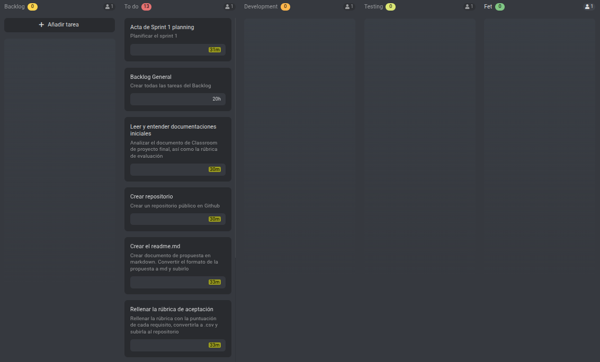
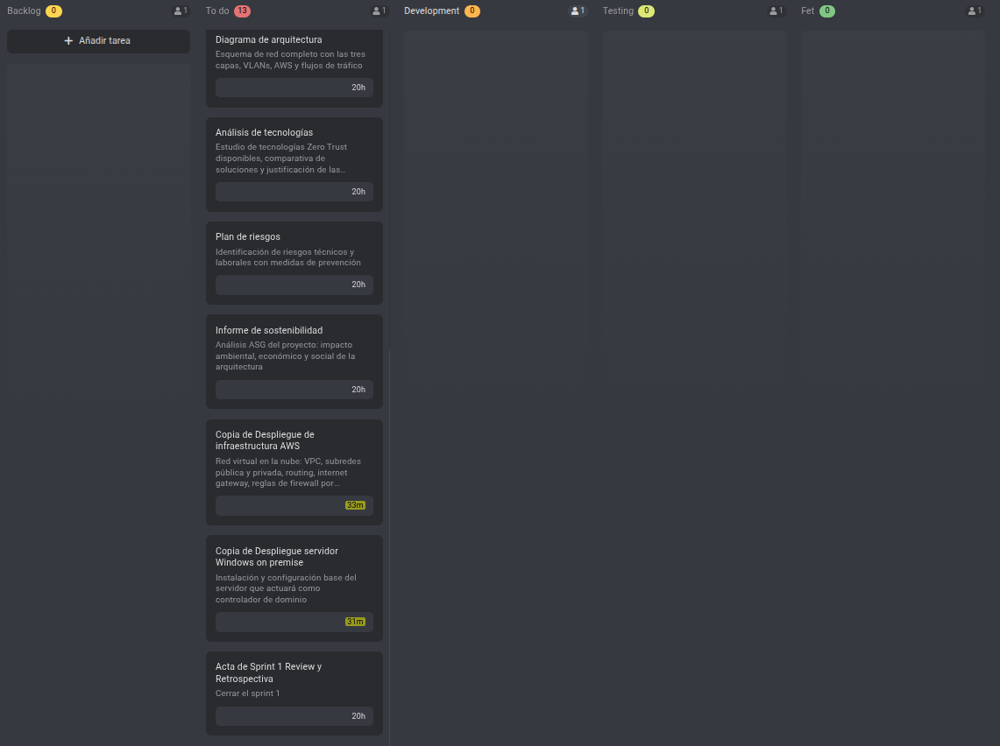

# Sprint 01 Planning — Fundamentos del Proyecto, Documentación e Infraestructura

**Periodo:** 13/04/2026 - 24/04/2026  
**Lugar:** Aula 209 - Institut Tecnològic de Barcelona  
**Fecha:** 14/04/2026  
**Hora:** 15:45  
**Asistentes:** Asier Barranco

---

## Objetivo del Sprint

Establecer la base completa del proyecto — estructura del repositorio, documentación inicial e informes transversales requeridos — y completar los primeros pasos de configuración de infraestructura (entorno AWS y servidor Windows on-premise), de modo que el Sprint 2 pueda comenzar directamente con la configuración de red y la capa de identidad.

---

## Estado del tablero en el Planning

En este caso, en el momento de la planificación del Sprint 1, están todas las tareas asignadas en "To Do". Esto es debido a que recién empieza el proyecto y no se arrastra ninguna tarea ni ha habido modificaciones por el momento.

---

## Definición de Hecho

Una tarea se considera completada cuando cumple todas las condiciones siguientes:

- La tarea está completamente implementada o redactada según su descripción.
- El resultado está commiteado en el repositorio de GitHub en la carpeta correspondiente.
- La tarea está marcada como finalizada en el tablero de ProofHub.
- Toda la documentación generada sigue el estándar del proyecto: formato Markdown y sus versiones correspondientes en inglés y español.