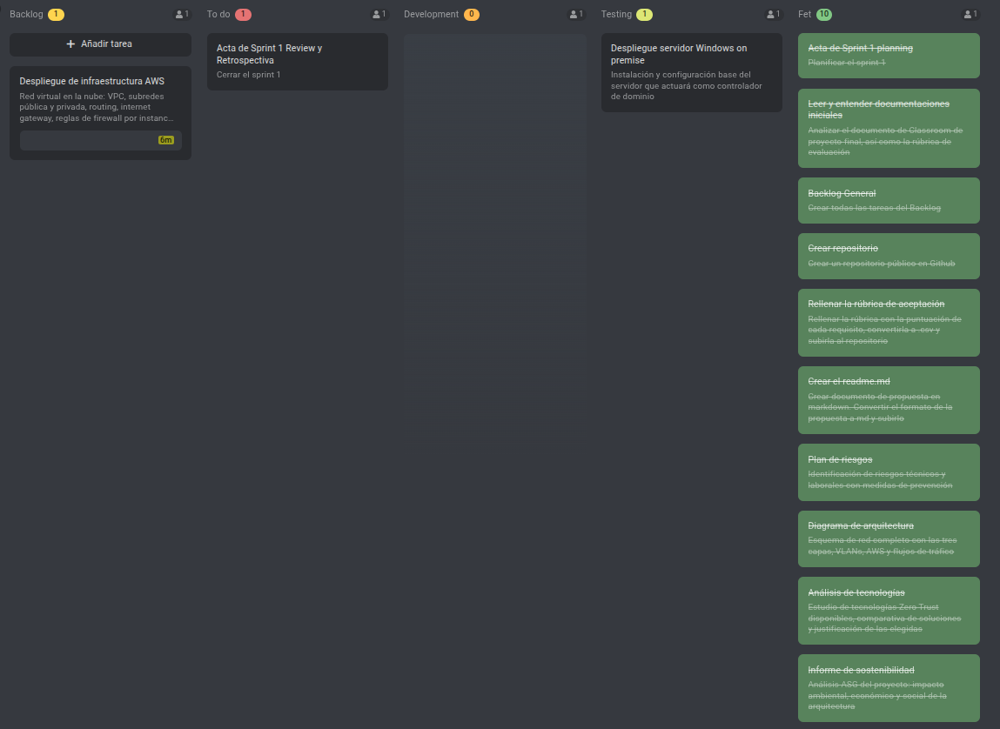

# Sprint 01 — Review & Retrospective

**Period:** 13/04/2026 → 24/04/2026  
**Date:** 27/04/2026  
**Time:** 15:10  
**Location:** Classroom 209  
**Attendees:** Asier Barranco  

---

## 1. Sprint Goal — Review

The goal of Sprint 1 was to complete all foundational documentation and begin the technical deployment of the on-premise infrastructure (Windows Server) and the AWS infrastructure.

The sprint was predominantly documentary in nature. All foundational documents were produced and committed to the repository. The technical deployment tasks were partially completed but not finished within the sprint window.

---

## 2. Sprint Board — End of Sprint

### 2.1 Completed tasks (Done)

Successfully delivered 100% of the planned bilingual documentation (English/Spanish). With all rubric-related dependencies resolved and committed to the repository, the project is now positioned to focus exclusively on infrastructure deployment.

### 2.2 Incomplete Tasks - Carried Over to Sprint 2

| # | Task | Reason |
|---|---|---|
| 11 | AWS infrastructure deployment | Not started — sprint time consumed by documentation |
| 12 | On-premise Windows Server deployment | Partially completed — AD DS installation in progress |
| 13 | Sprint 01 Review & Retrospective | Produced on 27/04, first day of Sprint 2 |
---

## 3. Calendar Change — Sprint Structure Update

During this sprint review, a change to the project calendar was formalised due to the academic schedule.

**Original structure:**

| Sprint | Period |
|---|---|
| Sprint 1 | 13/04/2026 → 24/04/2026 |
| Sprint 2 | 27/04/2026 → 08/05/2026 |
| Sprint 3 | 11/05/2026 → 15/05/2026 |

**Updated structure:**

| Sprint | Period |
|---|---|
| Sprint 1 | 13/04/2026 → 24/04/2026 |
| Sprint 2 | 27/04/2026 → 12/05/2026 |

Sprint 3 has been suppressed and merged into Sprint 2, which is extended accordingly. The project defence has also been confirmed for **20/05/2026**, which provides additional time after the Sprint 2 close date (12/05) for final testing and preparation of the defence presentation. These activities do not require a formal sprint and will be managed informally in that window.

All project documents that referenced a three-sprint structure have been updated to reflect this change.

---

## 4. Retrospective

### What went well
- All foundational documentation was completed to a high standard within the sprint
- The technology stack was decided and fully justified through market analysis
- The architecture diagram reached a final, validated state
- Repository structure was established and commits were made consistently

### What did not go well
- The sprint was more documentation-heavy than anticipated, leaving insufficient time for technical deployment
- The Windows Server deployment was underestimated in terms of time — environment setup (VirtualBox network configuration, OS installation) took longer than planned

### What will change in Sprint 2
- Technical tasks take priority from day one
- Documentation is produced alongside deployment, not before
- AWS infrastructure deployment and on-premise AD configuration are the first two tasks to close

---

## 5. Sprint 2 Forecast

Sprint 2 runs from **27/04/2026 to 12/05/2026**. It inherits the two incomplete tasks from Sprint 1 and covers the full technical implementation of the three architecture layers, including identity federation, perimeter configuration, corporate services and the Purple Team security phase.