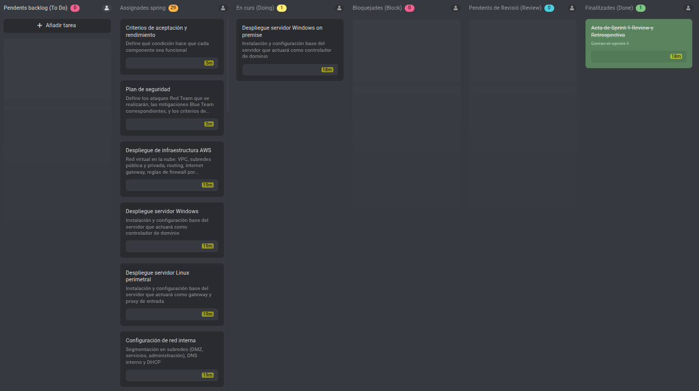

# Sprint 02 Planning — Implementación Técnica Completa y Validación de Seguridad

**Periodo:** 27/04/2026 - 12/05/2026  
**Lugar:** Aula 209 - Institut Tecnològic de Barcelona  
**Fecha:** 27/04/2026  
**Hora:** 17:00  
**Asistentes:** Asier Barranco  

---

## Objetivo del Sprint

**Nota**: A partir de este Sprint, los archivos internos como los Sprint Planning o Sprint Review constarán únicamente en español. No afecta a manuales y documentación técnica, que seguirán con las 2 variantes de idioma.

Completar la implementación técnica íntegra del sistema Zero Trust — infraestructura on-premise y AWS, federación de identidad, perímetro, servicios corporativos y automatización — y validar la arquitectura mediante una fase Purple Team documentada. El sprint cierra el proyecto en estado listo para la defensa del 20/05/2026.

Este sprint absorbe además las dos tareas técnicas no finalizadas del Sprint 1, e incorpora dos nuevos documentos de planificación identificados como necesarios tras la revisión con el tutor: los criterios de rendimiento y aceptación del sistema, y el plan de seguridad Red Team / Blue Team.

---

## Tareas del Sprint

### Arrastradas del Sprint 1
- Despliegue de infraestructura AWS (VPC, subredes, routing, security groups, instancias EC2)
- Despliegue servidor Windows Server on-premise *(en curso)*

### Documentación de planificación (nuevas)
- Criterios de rendimiento y aceptación del sistema
- Plan de seguridad — Red Team y Blue Team

### Fase 2 — Infraestructura on-premise
- Despliegue servidor Linux perimetral
- Configuración de red interna (segmentación, DNS, DHCP)

### Fase 3 — Active Directory
- Instalación y configuración de Active Directory
- Políticas de acceso (GPO)
- Gestión y provisioning de usuarios

### Fase 4 — Identidad federada
- Despliegue del proveedor de identidad (Keycloak)
- Federación con Active Directory (LDAP)
- Configuración SSO
- Configuración MFA
- Validación del flujo de autenticación

### Fase 5 — Perímetro y acceso
- Configuración del proxy inverso (Nginx)
- Gestión de certificados TLS (Let's Encrypt + Certbot)
- Protección perimetral activa (Fail2ban + UFW + Security Groups)

### Fase 6 — Base de datos
- Despliegue y hardening de la base de datos (MariaDB)

### Fase 7 — Servicios corporativos
- Servicio de gestión documental (Nextcloud + integración SSO)
- Servicio de comunicaciones (Mattermost + integración SSO)

### Fase 8 — Automatización y monitorización
- Script de monitorización de logs

### Fase 9 — Validación del sistema
- Validación de aislamiento de red
- Validación de acceso y permisos

### Fase 10 — Purple Team
- Ataque 1 — Fuerza bruta
- Ataque 2 — Robo de credenciales
- Ataque 3 — Secuestro de sesión
- Documentación Blue Team y respuesta al incidente

### Fase 11 — Cierre
- Plan de pruebas final
- Manual de usuario
- Sprint 02 Review y Retrospectiva

---

## Estado del tablero en el Planning

Las dos tareas arrastradas del Sprint 1 se incorporan directamente a "To Do". El resto de tareas proceden del backlog general y se asignan en su totalidad a este sprint, al ser el último sprint técnico del proyecto.

---

## Definición de Hecho

Una tarea se considera completada cuando cumple todas las condiciones siguientes:

- La tarea está completamente implementada o redactada según su descripción.
- El resultado está commiteado en el repositorio de GitHub en la carpeta correspondiente.
- La tarea está marcada como finalizada en el tablero de ProofHub.
- Toda la documentación técnica entregable sigue el estándar del proyecto: formato Markdown, redactada en inglés técnico. Las actas de sprint se redactan únicamente en español.