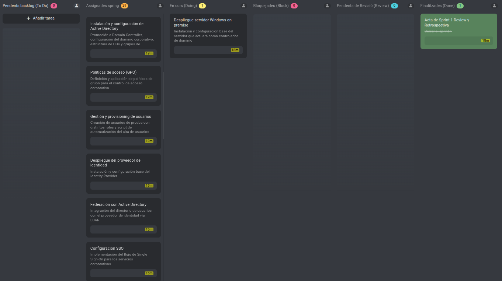
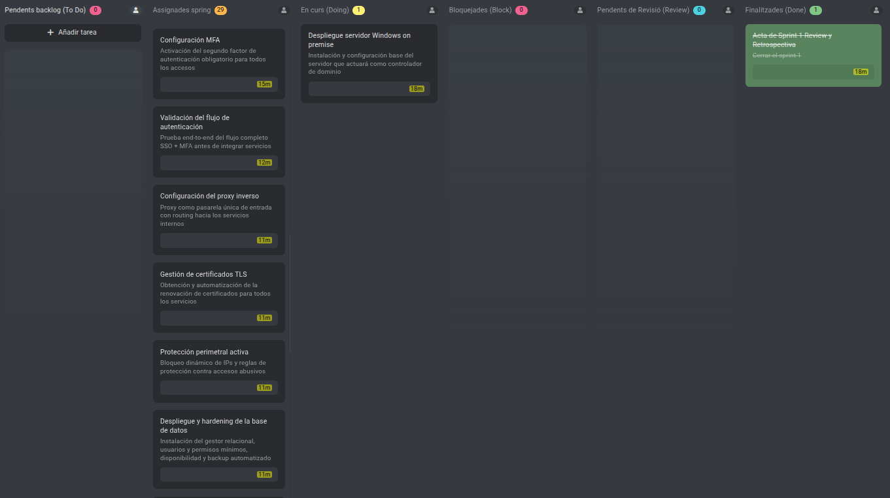
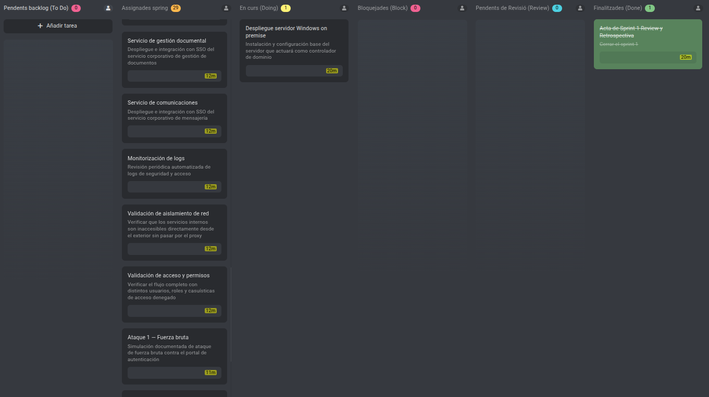
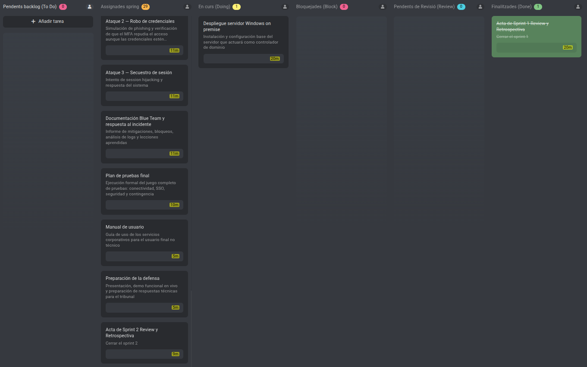

# Sprint 02 Planning — Implementación Técnica Completa y Validación de Seguridad

**Periodo:** 27/04/2026 - 12/05/2026  
**Lugar:** Aula 209 - Institut Tecnològic de Barcelona  
**Fecha:** 27/04/2026  
**Hora:** 17:00  
**Asistentes:** Asier Barranco  

---

## Objetivo del Sprint

**Nota**: A partir de este Sprint, los archivos internos como los Sprint Planning o Sprint Review constarán únicamente en español. No afecta a manuales y documentación técnica, que seguirán con las 2 variantes de idioma.

Completar la implementación técnica íntegra del sistema Zero Trust — infraestructura on-premise y AWS, federación de identidad, perímetro, servicios corporativos y automatización — y validar la arquitectura mediante una fase Purple Team documentada. El sprint cierra el proyecto en estado listo para la defensa del 20/05/2026.

Este sprint absorbe además las dos tareas técnicas no finalizadas del Sprint 1, e incorpora dos nuevos documentos de planificación identificados como necesarios tras la revisión con el tutor: los criterios de rendimiento y aceptación del sistema, y el plan de seguridad Red Team / Blue Team.

---

## Estado del tablero en el Planning

Las dos tareas arrastradas del Sprint 1 se incorporan directamente a "To Do". El resto de tareas proceden del backlog general y se asignan en su totalidad a este ambicioso sprint, al ser el último sprint técnico del proyecto.

---

## Definición de Hecho

Una tarea se considera completada cuando cumple todas las condiciones siguientes:

- La tarea está completamente implementada o redactada según su descripción.
- El resultado está commiteado en el repositorio de GitHub en la carpeta correspondiente.
- La tarea está marcada como finalizada en el tablero de ProofHub.
- Toda la documentación técnica entregable sigue el estándar del proyecto: formato Markdown, redactada en inglés técnico. Las actas de sprint se redactan únicamente en español.