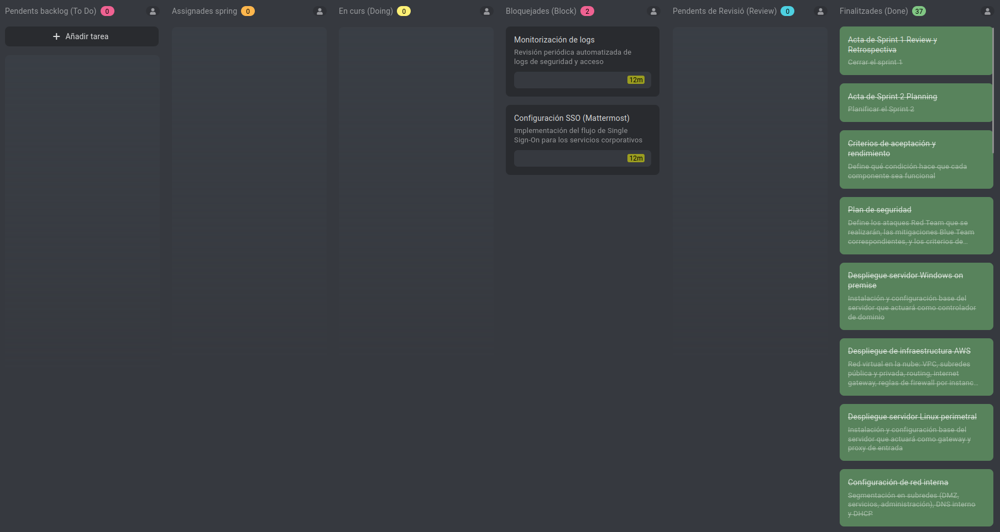
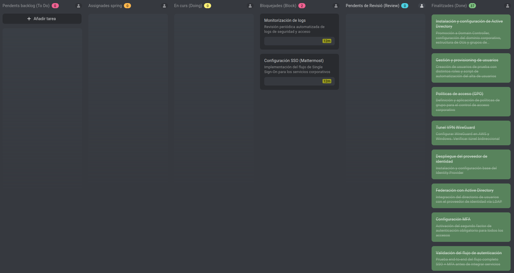
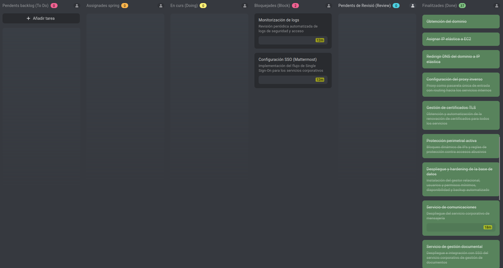
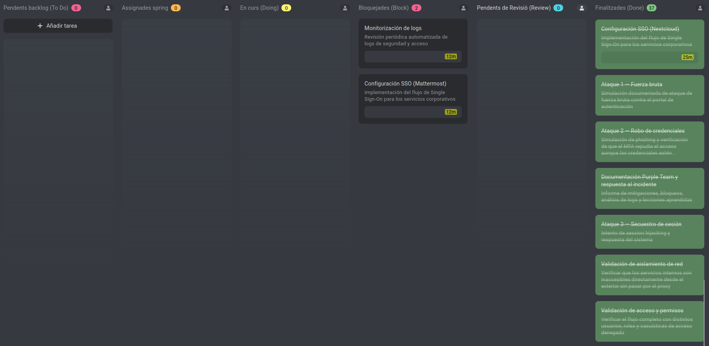
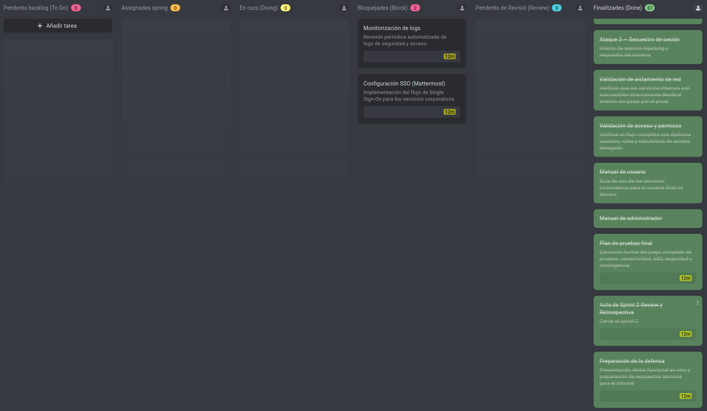

# Sprint 02 — Review y Retrospectiva

**Período:** 27/04/2026 → 12/05/2026  
**Fecha de revisión:** 17/05/2026  
**Hora:** 12:30  
**Lugar:** Remoto (domicilio)  
**Asistentes:** Asier Barranco  

---

## 1. Objetivo del Sprint — Revisión

El objetivo del Sprint 2 era completar la implementación técnica completa de las tres capas de la arquitectura Zero Trust, incluyendo la federación de identidad, configuración perimetral, servicios corporativos, validación de seguridad (Purple Team) y toda la documentación asociada.

El sprint heredó tres tareas incompletas del Sprint 1 (despliegue AWS, despliegue Windows Server y acta del Sprint 1 Review). Además, absorbió la totalidad de las tareas que originalmente estaban previstas para un Sprint 3 que fue suprimido por cambios en el calendario escolar.

**Resultado global:** se completaron 34 de las 36 tareas del backlog, quedando únicamente 2 tareas bloqueadas de forma justificada. El sistema Zero Trust está operativo de extremo a extremo, con autenticación federada SSO + MFA funcionando, documentación completa bilingüe y ejercicios Purple Team ejecutados y documentados.

---

## 2. Tablero al Final del Sprint

**Nota:** No es una imagen repetida, lo parece debido a que la columna Done es demasiado larga.

### 2.1 Tareas Completadas (Done)

Se completaron 34 tareas en total, organizadas por fase:

**Tareas heredadas del Sprint 1:**

| # | Tarea | Notas |
|---|---|---|
| 1 | Acta de Sprint 01 Review y Retrospectiva | Completada el primer día del Sprint 2 |
| 2 | Acta de Sprint 02 Planning | — |
| 3 | Criterios de aceptación y rendimiento | — |
| 4 | Plan de seguridad | — |

**Fase 1-2 — Infraestructura (on-premise + AWS):**

| # | Tarea | Notas |
|---|---|---|
| 5 | Despliegue servidor Windows Server on-premise | Heredada del Sprint 1 — completada |
| 6 | Despliegue infraestructura AWS (VPC, subredes, EC2, SG) | Heredada del Sprint 1 — completada |
| 7 | Despliegue Linux perimetral | Ubuntu 24.04 LTS en EC2 |
| 8 | Configuración de red interna | Segmentación pública/privada + host-only |

**Fase 3 — Active Directory:**

| # | Tarea | Notas |
|---|---|---|
| 9 | Instalación y configuración de Active Directory | Dominio `corp.zerotrust.local` operativo |
| 10 | Gestión y provisión de usuarios | `alice.smith`, `bob.jones`, `zt.admin`, `svc.keycloak` creados |
| 11 | Políticas de acceso (GPO) | Contraseñas, bloqueo de cuenta, auditoría configurados |

**Fase 4 — Identidad federada:**

| # | Tarea | Notas |
|---|---|---|
| 12 | Túnel VPN WireGuard | Enlace cifrado on-premise ↔ AWS operativo |
| 13 | Despliegue del proveedor de identidad | Keycloak 24.0.4 en Docker |
| 14 | Federación con Active Directory | LDAP sync vía WireGuard — usuarios importados |
| 15 | Configuración MFA | TOTP obligatorio para todos los usuarios del realm |
| 16 | Validación del flujo de autenticación | alice.smith autenticada contra AD + TOTP verificado |

**Fase 5 — Perímetro y dominio:**

| # | Tarea | Notas |
|---|---|---|
| 17 | Obtención del dominio (NUEVA) | `abb-ztcs.com` registrado en IONOS |
| 18 | Asignación de IP elástica (NUEVA) | `32.197.108.153` asociada a `ztcs-perimeter` |
| 19 | Redirección DNS del dominio (NUEVA) | A record `abb-ztcs.com → 32.197.108.153` |
| 20 | Configuración del proxy inverso | Nginx con TLS, security headers y routing a servicios |
| 21 | Gestión de certificados TLS | Let's Encrypt via Certbot — auto-renovación configurada |
| 22 | Protección perimetral activa | Fail2ban (4 jails) + UFW integrados |

**Fase 6-7 — Servicios corporativos:**

| # | Tarea | Notas |
|---|---|---|
| 23 | Despliegue y hardening de la base de datos | MariaDB 11.4 — usuarios dedicados, aislada en subred privada |
| 24 | Servicio de comunicaciones | Mattermost 9.7 desplegado en Docker — contenedor operativo, base de datos creada. Acceso web no funcional por incompatibilidad de subpath con el SSO de Nextcloud. Configuración e instrucciones documentadas en el repositorio |
| 25 | Servicio de gestión documental | Nextcloud 29 desplegado con SSO SAML operativo |
| 26 | Configuración SSO Nextcloud | Integración SAML 2.0 completa via API REST de Keycloak |

**Fase 10 — Purple Team:**

| # | Tarea | Notas |
|---|---|---|
| 27 | Ataque 1 — Fuerza bruta | SSH rechaza password auth; Fail2ban banea IP en Keycloak |
| 28 | Ataque 2 — Robo de credenciales | MFA bloquea acceso con contraseña válida robada |
| 29 | Ataque 3 — Secuestro de sesión | HTTPS, cookies seguras y validación server-side bloquean todos los vectores |
| 30 | Documentación Purple Team | Informe único con 3 ataques, 3 mitigaciones y respuesta al incidente |

**Fase 9 — Validación:**

| # | Tarea | Notas |
|---|---|---|
| 31 | Validación de aislamiento de red | 5 tests — todos pasados |
| 32 | Validación de acceso y permisos | 7 tests — todos pasados |

**Fase 11 — Cierre:**

| # | Tarea | Notas |
|---|---|---|
| 33 | Manual de usuario | Documentado en inglés y español |
| 34 | Manual de administrador | Documentado en inglés y español — referencia completa del sistema |

**Post-entrega:**

| # | Tarea | Notas |
|---|---|---|
| 35 | Preparación de la defensa | Presentación y ensayo de demo |

### 2.2 Tareas Bloqueadas

| # | Tarea | Motivo |
|---|---|---|
| 1 | SSO Mattermost | Limitación técnica: Mattermost no soporta subpath compartido con otra aplicación SSO en el mismo dominio. El servicio está desplegado y operativo con cuentas locales. La integración SSO requiere un subdominio dedicado. Documentado en la hoja de ruta futura. |
| 2 | Monitorización de logs | Descartada por limitación de tiempo. La funcionalidad está parcialmente cubierta por Fail2ban, que monitoriza logs de autenticación y actúa automáticamente. Un script de monitorización dedicado está propuesto en la hoja de ruta futura. |

### 2.3 Tareas Nuevas Añadidas al Sprint

Durante la ejecución del Sprint 2 se identificaron tres tareas no previstas en el backlog original que resultaron imprescindibles para completar la configuración del perímetro:

| # | Tarea | Justificación |
|---|---|---|
| 17 | Obtención del dominio | Prerrequisito para certificados TLS y URLs de producción — no identificado en la planificación inicial |
| 18 | Asignación de IP elástica | Prerrequisito para DNS estable — la IP dinámica de EC2 impedía configuración permanente |
| 19 | Redirección DNS | Enlace entre dominio registrado y la infraestructura AWS |

Estas tres tareas fueron ejecutadas como bloque antes de la configuración de Nginx y representan un aprendizaje sobre la importancia de incluir la configuración de dominio/DNS en la planificación de proyectos con infraestructura cloud.

---

## 3. Problemas Encontrados y Resoluciones

### 3.1 Keycloak 24 — Bug en consola de administración para clientes SAML

La pestaña "Client Scopes" de los clientes SAML en la consola de Keycloak 24 devolvía un error "Network response was not OK" tanto por URL pública como por túnel SSH. Esto impedía crear los mappers de atributos necesarios para la integración SSO con Nextcloud.

**Resolución:** toda la configuración de mappers SAML se realizó vía la API REST de Keycloak utilizando curl, bypassando completamente la consola web. Esta solución quedó documentada en `infrastructure/services/sso-nextcloud-setup.md`.

### 3.2 SAML — Atributos duplicados en la aserción

Al configurar el SSO entre Keycloak y Nextcloud, la aserción SAML contenía atributos con nombres duplicados, provocando el error "Found an Attribute element with duplicated Name" en Nextcloud.

**Resolución:** se identificó que el scope `role_list`, asignado por defecto a clientes SAML en Keycloak, generaba conflictos. Se eliminó del cliente vía API y se creó un único mapper usando el OID estándar (`urn:oid:0.9.2342.19200300.100.1.1`) como nombre de atributo, evitando colisiones.

### 3.3 Fail2ban — Logs de Docker no compatibles con el filtro

El filtro de Fail2ban para Keycloak no detectaba intentos fallidos porque los logs de Docker usaban formato JSON, incompatible con el parsing de Fail2ban.

**Resolución:** se reconfiguró el contenedor de Keycloak para usar el driver de logging `journald` en lugar del driver JSON por defecto. El jail de Fail2ban se actualizó para leer del journal de systemd con `CONTAINER_TAG=keycloak`, lo que permitió la detección y baneo automático de IPs atacantes.

### 3.4 Mattermost — Incompatibilidad de subpath con Nginx

Mattermost no funciona correctamente cuando se sirve bajo un subpath (`/mattermost/`) compartiendo dominio con otra aplicación que tiene SSO activo en la raíz (`/`). El flujo de redirecciones de Mattermost colisiona con el redirect SAML de Nextcloud, generando bucles infinitos.

**Resolución:** tras múltiples intentos de configuración, se documentó como limitación técnica y se propuso la solución (subdominio dedicado) en la hoja de ruta futura. El servicio queda desplegado y operativo con cuentas locales.

### 3.5 Instancia ztcs-services sin internet

La instancia de servicios reside en una subred privada sin acceso a internet por diseño. Esto complicó la instalación de Docker, la descarga de imágenes y la instalación de la app SAML en Nextcloud.

**Resolución:** se creó un NAT Gateway temporal en AWS en tres ocasiones durante el sprint — para instalar Docker, para descargar imágenes de contenedores y para instalar la app `user_saml`. En cada caso el NAT Gateway fue eliminado inmediatamente después de la instalación, restaurando el aislamiento de red. El procedimiento quedó documentado en `infrastructure/services/services-setup.md`.

---

## 4. Métricas del Sprint

| Métrica | Valor |
|---|---|
| Tareas planificadas | 36 |
| Tareas completadas | 34 |
| Tareas bloqueadas | 2 |
| Tareas nuevas añadidas | 3 |
| Velocidad real | 94% |
| Duración del sprint | 16 días (27/04 → 12/05) |
| Horas totales estimadas | ~70 horas |

---

## 5. Retrospectiva

### Qué ha ido bien

- La implementación técnica de las tres capas se completó en un único sprint, con el sistema funcionando de extremo a extremo
- La integración SSO SAML entre Keycloak y Nextcloud quedó operativa a pesar de múltiples problemas técnicos con Keycloak 24
- Los ejercicios Purple Team se ejecutaron con resultados reales — Fail2ban baneó automáticamente la IP atacante durante la prueba de fuerza bruta
- La documentación se produjo en paralelo al despliegue, no al final — cada componente se documentó inmediatamente después de su configuración
- El repositorio alcanzó 83 archivos con documentación completa bilingüe, capturas de evidencia y configuraciones versionadas
- Los 25 tests del plan de pruebas pasaron satisfactoriamente

### Qué no ha ido bien

- La integración SSO de Nextcloud consumió significativamente más tiempo del estimado debido a bugs de Keycloak 24, problemas con atributos SAML duplicados y tokens que expiraban cada 60 segundos
- Se invirtió tiempo en intentar hacer funcionar Mattermost bajo un subpath compartido — un problema que resultó ser una limitación técnica del producto, no un error de configuración
- La identificación tardía de la necesidad de un dominio y DNS retrasó la configuración del perímetro — debería haberse incluido en la planificación inicial
- El presupuesto de tiempo para la fase de automatización (scripts de monitorización) fue insuficiente tras los retrasos acumulados en SSO

### Lecciones aprendidas

- **Investigar limitaciones de producto antes de planificar:** la incompatibilidad de Mattermost con subpaths se habría detectado con una investigación previa, ahorrando varias horas de troubleshooting
- **El dominio y DNS son prerrequisitos de infraestructura:** en proyectos cloud con TLS y SSO, el registro de dominio debe planificarse como tarea de infraestructura, no como algo implícito
- **La API REST como alternativa a interfaces con bugs:** cuando la consola de administración falla, la API REST es un recurso fiable y reproducible que además genera documentación más precisa
- **Los tokens de administración tienen TTL corto por defecto:** ampliar el TTL al inicio de una sesión de configuración evita interrupciones constantes

---

## 6. Estado del Proyecto al Cierre del Sprint

El sistema Zero Trust Corporate está operativo de extremo a extremo:

| Capa | Estado |
|---|---|
| Capa 1 — Identidad (AD) | ✓ Operativo — usuarios, grupos, GPOs, LDAP accesible vía WireGuard |
| Capa 2 — Servicios (Nextcloud, MariaDB) | ✓ Operativo — SSO SAML + MFA funcionando |
| Capa 2 — Servicios (Mattermost) | ⚠ Parcialmente implementado — contenedor corriendo, acceso web no operativo. SSO bloqueado. Documentado en hoja de ruta futura. |
| Capa 3 — Perímetro (Nginx, Keycloak, Fail2ban) | ✓ Operativo — TLS, headers, baneo automático |
| Purple Team | ✓ Completado — 3 ataques ejecutados y documentados |
| Validación | ✓ 25/25 tests pasados |
| Documentación | ✓ Completa en inglés y español |

**Flujo end-to-end verificado:** usuario → `https://abb-ztcs.com` → Nginx (TLS) → Keycloak (SSO) → Active Directory (LDAP vía WireGuard) → TOTP (MFA) → SAML assertion → Nextcloud (dashboard).